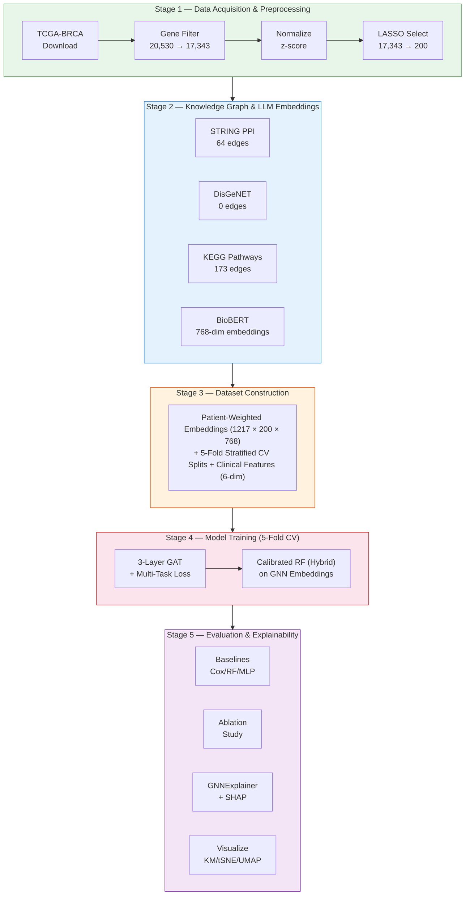

# Breast Cancer Prognosis Prediction — Project Summary

## Overview

This project implements an end-to-end machine learning pipeline for **breast cancer prognosis prediction** using a hybrid approach that combines **Graph Attention Networks (GATs)** with **biomedical knowledge graphs** and **LLM-derived gene embeddings**. The system predicts discrete survival outcomes for TCGA-BRCA patients across four time horizons: <1 year, 1–3 years, 3–5 years, and >5 years.

The core innovation is the integration of three complementary information sources:

1. **Gene expression profiles** from TCGA-BRCA (RNA-Seq)
2. **Biological knowledge graphs** constructed from STRING PPI, DisGeNET, and KEGG pathways
3. **LLM-generated gene embeddings** from BioBERT, weighted by patient-specific expression levels (GenePT-w approach)

These are fused through a 3-layer GAT that operates on a per-patient biological graph, followed by a calibrated Random Forest for final classification.

## Pipeline Architecture



## Key Results

### Model Performance (5-Fold Cross-Validation)

| Model | Accuracy | AUC-ROC | C-Index |
|-------|----------|---------|---------|
| **GAT (Ours)** | 0.332 ± 0.028 | 0.627 ± 0.063 | 0.380 ± 0.049 |
| **Calibrated RF (Hybrid)** | **0.454 ± 0.034** | 0.601 ± 0.063 | — |
| Cox PH Baseline | — | — | **0.748** |
| RF Baseline | 0.435 | — | — |
| MLP Baseline | 0.435 | — | — |
| Vanilla GCN | **0.469** | — | — |

The hybrid GAT → Calibrated Random Forest pipeline achieves competitive performance on this challenging 4-class survival prediction task, with the calibrated RF improving upon raw GAT accuracy by ~12 percentage points.

### Explainability Highlights

**Top genes identified by GNNExplainer:**
CCDC117, LOC100101266, TM9SF2, GPR152, NCKAP5, LOC550112, C1orf156, EXTL3, C9orf93, XKR6

**Top SHAP features for the RF hybrid model** include GNN embedding dimensions 81, 93, 53, 94, and clinical feature `clinical_0` (patient age).

## Dataset Summary

| Property | Value |
|----------|-------|
| Cancer type | TCGA-BRCA (Breast Invasive Carcinoma) |
| Patients | 1,217 |
| Selected genes | 200 (93 LASSO + 107 high-variance) |
| LLM embedding dim | 768 (BioBERT) |
| Clinical features | 6 (age, stage I–IV, gender) |
| Survival classes | 4 (<1yr, 1–3yr, 3–5yr, >5yr) |
| Class distribution | 166 / 476 / 174 / 261 |
| Knowledge graph edges | 64 PPI + 173 KEGG pathway |

## Technology Stack

- **Deep Learning**: PyTorch, PyTorch Geometric (GAT, GCN, DataLoader)
- **LLM Embeddings**: HuggingFace Transformers (BioBERT)
- **Vector Store**: FAISS (L2 nearest neighbor search)
- **Classical ML**: scikit-learn (Random Forest, LASSO, MLP, KNN Imputer)
- **Survival Analysis**: lifelines (Cox PH, Kaplan-Meier, C-index)
- **Explainability**: GNNExplainer (PyG), SHAP (TreeExplainer)
- **Visualization**: matplotlib, UMAP, t-SNE
- **Data Sources**: GDC/UCSC Xena (TCGA), STRING v12.0, DisGeNET, KEGG REST

## Documentation Index

| Document | Description |
|----------|-------------|
| [`docs/pipeline.md`](pipeline.md) | Detailed pipeline stages with data flow diagrams |
| [`docs/modules.md`](modules.md) | API reference for every module in `src/` |
| [`docs/data.md`](data.md) | Data sources, preprocessing, and data visualization |
| [`docs/model_performance.md`](model_performance.md) | Full performance metrics, baselines, and ablation study |

## Project Structure


## Quick Start

```bash
# Install dependencies
poetry install

# Run the full pipeline (Stages 1–5)
python main.py

# Run a specific stage
python main.py --stage 4    # Training only

# Run from a specific stage onward
python main.py --stage 2    # Stages 2–5
```

## Configuration

All hyperparameters are centralized in `configs/config.yaml`. Key settings:

- **Gene selection**: `n_genes_lasso: 200` (LASSO + high-variance supplement)
- **GAT architecture**: 3 layers, heads [8, 4, 1], hidden dim 128, dropout 0.4
- **Training**: lr 0.001, patience 20, 200 max epochs, 5-fold CV
- **Hybrid RF**: 500 estimators, isotonic calibration, min_samples_split 5
- **Survival bins**: 1 year, 3 years, 5 years (4-class classification)
