# Project Diagrams

Comprehensive Mermaid diagrams covering every aspect of the breast cancer prognosis prediction pipeline — architecture, data flow, runtime, and decision logic.

---

## Table of Contents

1. [End-to-End Pipeline](#1-end-to-end-pipeline)
2. [Pipeline Timeline (Gantt)](#2-pipeline-timeline)
3. [Module Dependency Graph](#3-module-dependency-graph)
4. [Data Acquisition Flow](#4-data-acquisition-flow)
5. [Preprocessing Pipeline](#5-preprocessing-pipeline)
6. [Gene Filtering Funnel](#6-gene-filtering-funnel)
7. [Knowledge Graph Construction](#7-knowledge-graph-construction)
8. [Knowledge Graph Entity Relationships](#8-knowledge-graph-entity-relationships)
9. [LLM Embedding Generation](#9-llm-embedding-generation)
10. [GenePT-w Patient Embedding](#10-genept-w-patient-embedding)
11. [Dataset Construction & SMOTE Decision](#11-dataset-construction--smote-decision)
12. [GAT Model Architecture](#12-gat-model-architecture)
13. [HybridModel Forward Pass](#13-hybridmodel-forward-pass)
14. [Training Loop](#14-training-loop)
15. [Cross-Validation Strategy](#15-cross-validation-strategy)
16. [Hybrid RF Training](#16-hybrid-rf-training)
17. [Evaluation & Baselines](#17-evaluation--baselines)
18. [Ablation Study](#18-ablation-study)
19. [Explainability Pipeline](#19-explainability-pipeline)
20. [Visualization Outputs](#20-visualization-outputs)
21. [File Artifact Map](#21-file-artifact-map)
22. [Class Distribution & Weighting](#22-class-distribution--weighting)
23. [Error Handling & Fallback Strategy](#23-error-handling--fallback-strategy)
24. [Model Comparison](#24-model-comparison)

---

## 1. End-to-End Pipeline

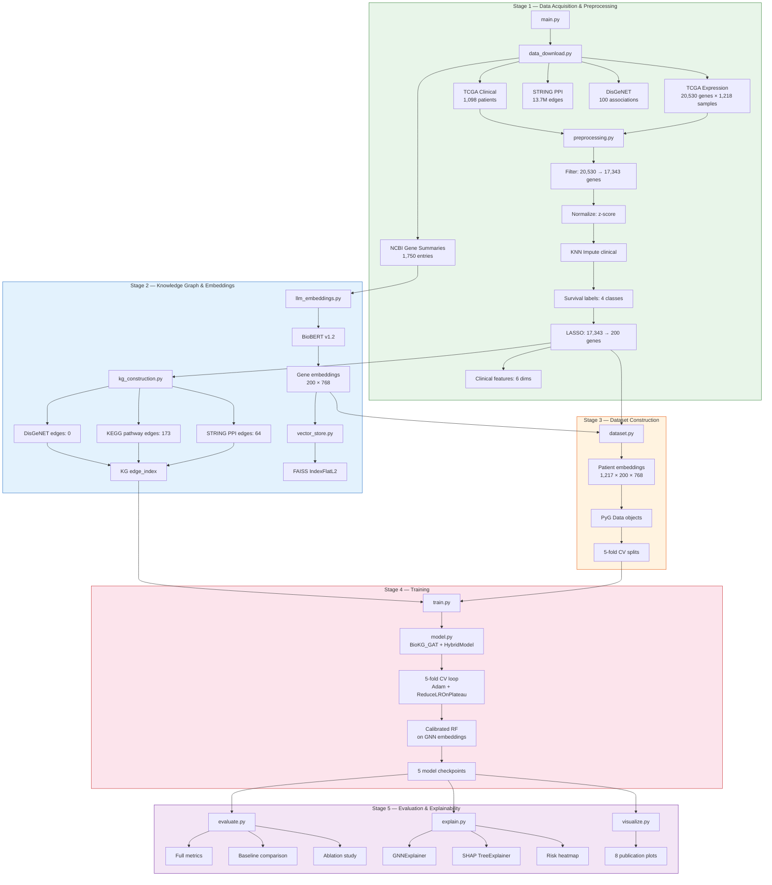
```mermaid
flowchart TB
    subgraph S1["Stage 1 — Data Acquisition & Preprocessing"]
        A[main.py] --> B[data_download.py]
        B --> B1[TCGA Expression<br/>20,530 genes × 1,218 samples]
        B --> B2[TCGA Clinical<br/>1,098 patients]
        B --> B3[STRING PPI<br/>13.7M edges]
        B --> B4[DisGeNET<br/>100 associations]
        B --> B5[NCBI Gene Summaries<br/>1,750 entries]

        B1 & B2 --> C[preprocessing.py]
        C --> C1[Filter: 20,530 → 17,343 genes]
        C1 --> C2[Normalize: z-score]
        C2 --> C3[KNN Impute clinical]
        C3 --> C4[Survival labels: 4 classes]
        C4 --> C5[LASSO: 17,343 → 200 genes]
        C5 --> C6[Clinical features: 6 dims]
    end

    subgraph S2["Stage 2 — Knowledge Graph & Embeddings"]
        C5 --> D[kg_construction.py]
        D --> D1[STRING PPI edges: 64]
        D --> D2[KEGG pathway edges: 173]
        D --> D3[DisGeNET edges: 0]
        D1 & D2 & D3 --> D4[KG edge_index]

        B5 --> E[llm_embeddings.py]
        E --> E1[BioBERT v1.2]
        E1 --> E2[Gene embeddings<br/>200 × 768]

        E2 --> F[vector_store.py]
        F --> F1[FAISS IndexFlatL2]
    end

    subgraph S3["Stage 3 — Dataset Construction"]
        E2 & C5 --> G[dataset.py]
        G --> G1[Patient embeddings<br/>1,217 × 200 × 768]
        G1 --> G2[PyG Data objects]
        G2 --> G3[5-fold CV splits]
    end

    subgraph S4["Stage 4 — Training"]
        G3 & D4 --> H[train.py]
        H --> H1[model.py<br/>BioKG_GAT + HybridModel]
        H1 --> H2[5-fold CV loop<br/>Adam + ReduceLROnPlateau]
        H2 --> H3[Calibrated RF<br/>on GNN embeddings]
        H3 --> H4[5 model checkpoints]
    end

    subgraph S5["Stage 5 — Evaluation & Explainability"]
        H4 --> I[evaluate.py]
        I --> I1[Full metrics]
        I --> I2[Baseline comparison]
        I --> I3[Ablation study]

        H4 --> J[explain.py]
        J --> J1[GNNExplainer]
        J --> J2[SHAP TreeExplainer]
        J --> J3[Risk heatmap]

        H4 --> K[visualize.py]
        K --> K1[8 publication plots]
    end

    style S1 fill:#e8f5e9,stroke:#2e7d32
    style S2 fill:#e3f2fd,stroke:#1565c0
    style S3 fill:#fff3e0,stroke:#e65100
    style S4 fill:#fce4ec,stroke:#c62828
    style S5 fill:#f3e5f5,stroke:#6a1b9a
```

---

## 2. Pipeline Timeline

```mermaid
gantt
    title Pipeline Execution Timeline (~2 hours total)
    dateFormat HH:mm
    axisFormat %H:%M

    section Stage 1
    Data Download (GDC + Xena)           :a1, 22:31, 3min
    Preprocessing (LASSO ~18m)           :a2, 22:34, 18min
    Gene Summaries (NCBI)                :a3, 22:52, 1min

    section Stage 2
    Knowledge Graph (KEGG API)           :b1, 22:53, 6min
    BioBERT Embeddings (cached)          :b2, 22:59, 1min
    FAISS Vector Store                   :b3, 22:59, 1min

    section Stage 3
    Dataset Construction                 :c1, 22:59, 1min

    section Stage 4
    Fold 1 (156 epochs)                  :d1, 22:59, 30min
    Fold 2 (110 epochs)                  :d2, 23:29, 21min
    Fold 3 (127 epochs)                  :d3, 23:50, 24min
    Fold 4 (25 epochs)                   :d4, 00:14, 5min
    Fold 5 (22 epochs)                   :d5, 00:18, 4min

    section Stage 5
    Evaluation + Baselines               :e1, 00:22, 4min
    GNNExplainer + SHAP                  :e2, 00:26, 4min
    Visualizations                       :e3, 00:30, 1min
```

---

## 3. Module Dependency Graph

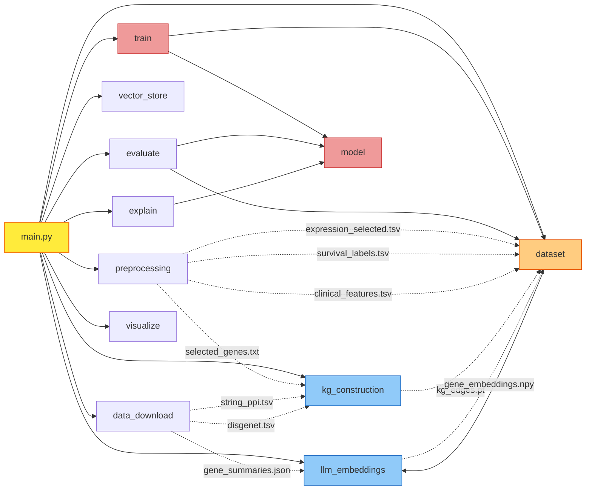
```mermaid
flowchart LR
    main[main.py] --> dd[data_download]
    main --> pp[preprocessing]
    main --> kg[kg_construction]
    main --> emb[llm_embeddings]
    main --> vs[vector_store]
    main --> ds[dataset]
    main --> tr[train]
    main --> ev[evaluate]
    main --> ex[explain]
    main --> viz[visualize]

    tr --> mo[model]
    tr --> ds
    ds --> emb

    ev --> ds
    ev --> mo
    ex --> mo

    pp -.->|selected_genes.txt| kg
    pp -.->|expression_selected.tsv| ds
    pp -.->|survival_labels.tsv| ds
    pp -.->|clinical_features.tsv| ds
    kg -.->|kg_edges.pt| ds
    emb -.->|gene_embeddings.npy| ds
    dd -.->|gene_summaries.json| emb
    dd -.->|string_ppi.tsv| kg
    dd -.->|disgenet.tsv| kg

    style main fill:#ffeb3b,stroke:#f57f17,stroke-width:2px
    style mo fill:#ef9a9a,stroke:#c62828
    style tr fill:#ef9a9a,stroke:#c62828
    style ds fill:#ffcc80,stroke:#e65100
    style emb fill:#90caf9,stroke:#1565c0
    style kg fill:#90caf9,stroke:#1565c0
```

*Solid arrows = import dependencies. Dashed arrows = file-based data flow.*

---

## 4. Data Acquisition Flow

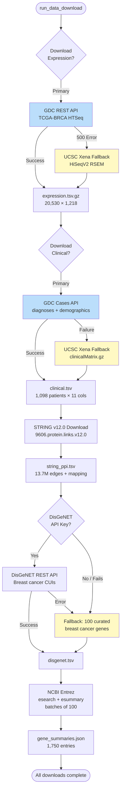
```mermaid
flowchart TD
    START([run_data_download]) --> EXP{Download<br/>Expression?}

    EXP -->|Primary| GDC_E[GDC REST API<br/>TCGA-BRCA HTSeq]
    GDC_E -->|Success| EXP_OK[expression.tsv.gz<br/>20,530 × 1,218]
    GDC_E -->|500 Error| XENA_E[UCSC Xena Fallback<br/>HiSeqV2 RSEM]
    XENA_E --> EXP_OK

    EXP_OK --> CLIN{Download<br/>Clinical?}

    CLIN -->|Primary| GDC_C[GDC Cases API<br/>diagnoses + demographics]
    GDC_C -->|Success| CLIN_OK[clinical.tsv<br/>1,098 patients × 11 cols]
    GDC_C -->|Failure| XENA_C[UCSC Xena Fallback<br/>clinicalMatrix.gz]
    XENA_C --> CLIN_OK

    CLIN_OK --> STR[STRING v12.0 Download<br/>9606.protein.links.v12.0]
    STR --> STR_OK[string_ppi.tsv<br/>13.7M edges + mapping]

    STR_OK --> DIS{DisGeNET<br/>API Key?}
    DIS -->|Yes| API[DisGeNET REST API<br/>Breast cancer CUIs]
    DIS -->|No / Fails| FALL[Fallback: 100 curated<br/>breast cancer genes]
    API -->|Success| DIS_OK[disgenet.tsv]
    API -->|Error| FALL
    FALL --> DIS_OK

    DIS_OK --> NCBI[NCBI Entrez<br/>esearch + esummary<br/>batches of 100]
    NCBI --> SUM_OK[gene_summaries.json<br/>1,750 entries]

    SUM_OK --> DONE([All downloads complete])

    style GDC_E fill:#bbdefb
    style GDC_C fill:#bbdefb
    style XENA_E fill:#fff9c4
    style XENA_C fill:#fff9c4
    style FALL fill:#fff9c4
```

---

## 5. Preprocessing Pipeline

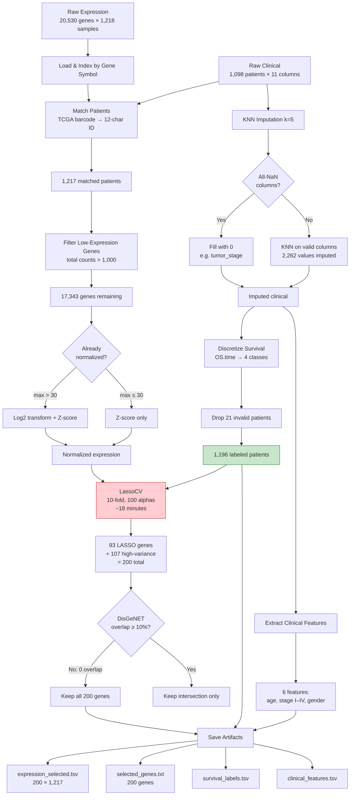
```mermaid
flowchart TD
    RAW_E[Raw Expression<br/>20,530 genes × 1,218 samples] --> LOAD[Load & Index by Gene Symbol]
    RAW_C[Raw Clinical<br/>1,098 patients × 11 columns] --> MATCH

    LOAD --> MATCH[Match Patients<br/>TCGA barcode → 12-char ID]
    MATCH --> MATCHED[1,217 matched patients]

    MATCHED --> FILT[Filter Low-Expression Genes<br/>total counts > 1,000]
    FILT --> FILT_OUT[17,343 genes remaining]

    FILT_OUT --> NORM{Already<br/>normalized?}
    NORM -->|max > 30| LOG[Log2 transform + Z-score]
    NORM -->|max ≤ 30| ZSCORE[Z-score only]
    LOG --> NORM_OUT[Normalized expression]
    ZSCORE --> NORM_OUT

    RAW_C --> IMP[KNN Imputation k=5]
    IMP --> IMP_CHK{All-NaN<br/>columns?}
    IMP_CHK -->|Yes| FILL0[Fill with 0<br/>e.g. tumor_stage]
    IMP_CHK -->|No| KNN[KNN on valid columns<br/>2,262 values imputed]
    FILL0 --> IMP_OUT[Imputed clinical]
    KNN --> IMP_OUT

    IMP_OUT --> SURV[Discretize Survival<br/>OS.time → 4 classes]
    SURV --> DROP[Drop 21 invalid patients]
    DROP --> LABELS[1,196 labeled patients]

    NORM_OUT --> LASSO[LassoCV<br/>10-fold, 100 alphas<br/>~18 minutes]
    LABELS --> LASSO
    LASSO --> LASSO_OUT[93 LASSO genes<br/>+ 107 high-variance<br/>= 200 total]

    LASSO_OUT --> DISGENET{DisGeNET<br/>overlap ≥ 10%?}
    DISGENET -->|No: 0 overlap| KEEP[Keep all 200 genes]
    DISGENET -->|Yes| INTERSECT[Keep intersection only]

    IMP_OUT --> CLIN_FE[Extract Clinical Features]
    CLIN_FE --> CLIN_OUT[6 features:<br/>age, stage I–IV, gender]

    KEEP --> SAVE[Save Artifacts]
    CLIN_OUT --> SAVE
    LABELS --> SAVE

    SAVE --> F1[expression_selected.tsv<br/>200 × 1,217]
    SAVE --> F2[selected_genes.txt<br/>200 genes]
    SAVE --> F3[survival_labels.tsv]
    SAVE --> F4[clinical_features.tsv]

    style LASSO fill:#ffcdd2,stroke:#c62828
    style LABELS fill:#c8e6c9,stroke:#2e7d32
```

---

## 6. Gene Filtering Funnel

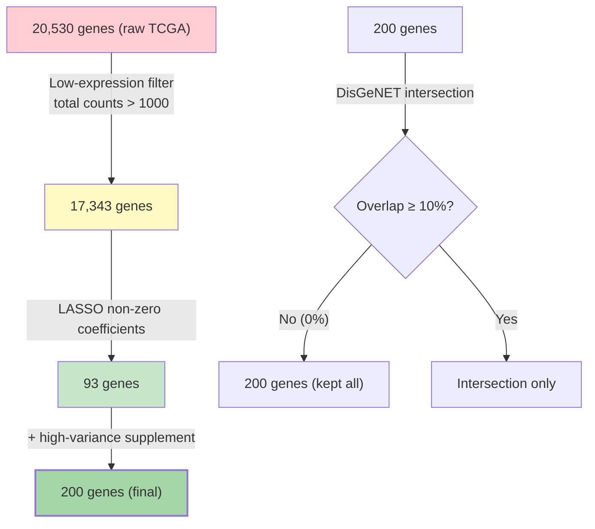
```mermaid
flowchart TD
    A["20,530 genes (raw TCGA)"] -->|Low-expression filter<br/>total counts > 1000| B["17,343 genes"]
    B -->|LASSO non-zero coefficients| C["93 genes"]
    C -->|+ high-variance supplement| D["200 genes (final)"]

    A2["200 genes"] -->|DisGeNET intersection| A3{Overlap ≥ 10%?}
    A3 -->|"No (0%)"| A4["200 genes (kept all)"]
    A3 -->|Yes| A5["Intersection only"]

    style A fill:#ffcdd2
    style B fill:#fff9c4
    style C fill:#c8e6c9
    style D fill:#a5d6a7,stroke-width:2px
```

---

## 7. Knowledge Graph Construction

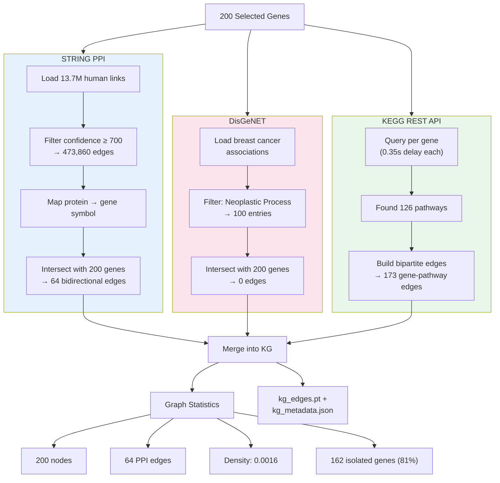
```mermaid
flowchart TD
    GENES[200 Selected Genes] --> PPI
    GENES --> DIS
    GENES --> KEGG

    subgraph PPI["STRING PPI"]
        P1[Load 13.7M human links] --> P2[Filter confidence ≥ 700<br/>→ 473,860 edges]
        P2 --> P3[Map protein → gene symbol]
        P3 --> P4[Intersect with 200 genes<br/>→ 64 bidirectional edges]
    end

    subgraph DIS["DisGeNET"]
        D1[Load breast cancer<br/>associations] --> D2[Filter: Neoplastic Process<br/>→ 100 entries]
        D2 --> D3[Intersect with 200 genes<br/>→ 0 edges]
    end

    subgraph KEGG["KEGG REST API"]
        K1["Query per gene<br/>(0.35s delay each)"] --> K2[Found 126 pathways]
        K2 --> K3[Build bipartite edges<br/>→ 173 gene-pathway edges]
    end

    P4 --> MERGE[Merge into KG]
    D3 --> MERGE
    K3 --> MERGE
    MERGE --> STATS[Graph Statistics]
    MERGE --> SAVE_KG[kg_edges.pt +<br/>kg_metadata.json]

    STATS --> S1["200 nodes"]
    STATS --> S2["64 PPI edges"]
    STATS --> S3["Density: 0.0016"]
    STATS --> S4["162 isolated genes (81%)"]

    style PPI fill:#e3f2fd
    style DIS fill:#fce4ec
    style KEGG fill:#e8f5e9
```

---

## 8. Knowledge Graph Entity Relationships

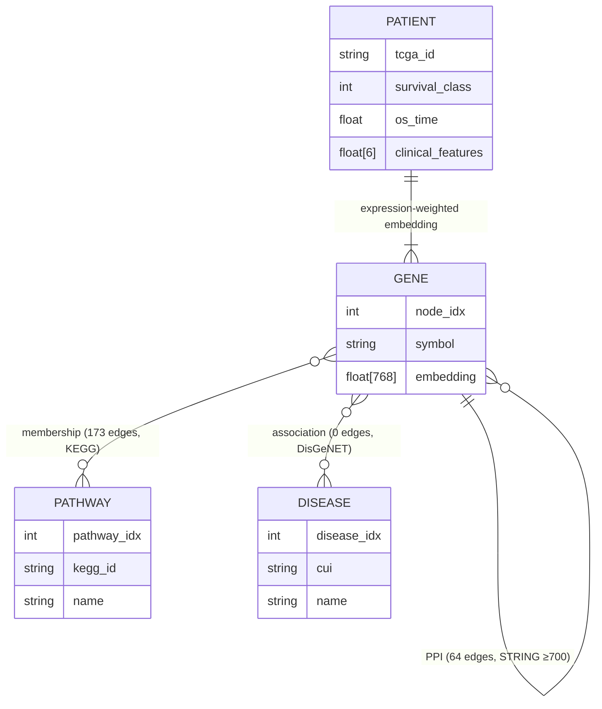
```mermaid
erDiagram
    GENE {
        int node_idx
        string symbol
        float[768] embedding
    }
    PATHWAY {
        int pathway_idx
        string kegg_id
        string name
    }
    DISEASE {
        int disease_idx
        string cui
        string name
    }
    PATIENT {
        string tcga_id
        int survival_class
        float os_time
        float[6] clinical_features
    }

    GENE ||--o{ GENE : "PPI (64 edges, STRING ≥700)"
    GENE }o--o{ PATHWAY : "membership (173 edges, KEGG)"
    GENE }o--o{ DISEASE : "association (0 edges, DisGeNET)"
    PATIENT ||--|{ GENE : "expression-weighted embedding"
```

---

## 9. LLM Embedding Generation

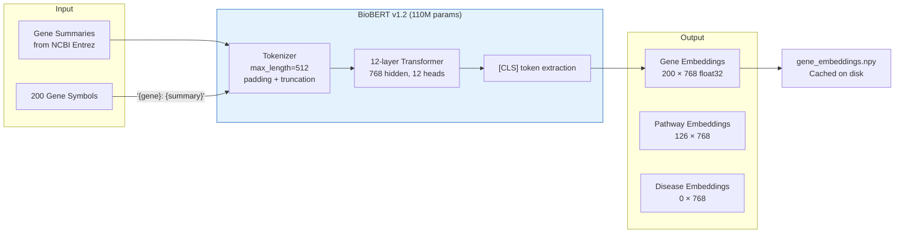
```mermaid
flowchart LR
    subgraph Input
        SUM[Gene Summaries<br/>from NCBI Entrez]
        GL[200 Gene Symbols]
    end

    subgraph BioBERT["BioBERT v1.2 (110M params)"]
        TOK[Tokenizer<br/>max_length=512<br/>padding + truncation]
        ENC[12-layer Transformer<br/>768 hidden, 12 heads]
        CLS["[CLS] token extraction"]
    end

    subgraph Output
        GE[Gene Embeddings<br/>200 × 768 float32]
        PE[Pathway Embeddings<br/>126 × 768]
        DE[Disease Embeddings<br/>0 × 768]
    end

    SUM --> TOK
    GL --> |"'{gene}: {summary}'"| TOK
    TOK --> ENC
    ENC --> CLS
    CLS --> GE

    GE --> CACHE[gene_embeddings.npy<br/>Cached on disk]

    style BioBERT fill:#e3f2fd,stroke:#1565c0
```

---

## 10. GenePT-w Patient Embedding

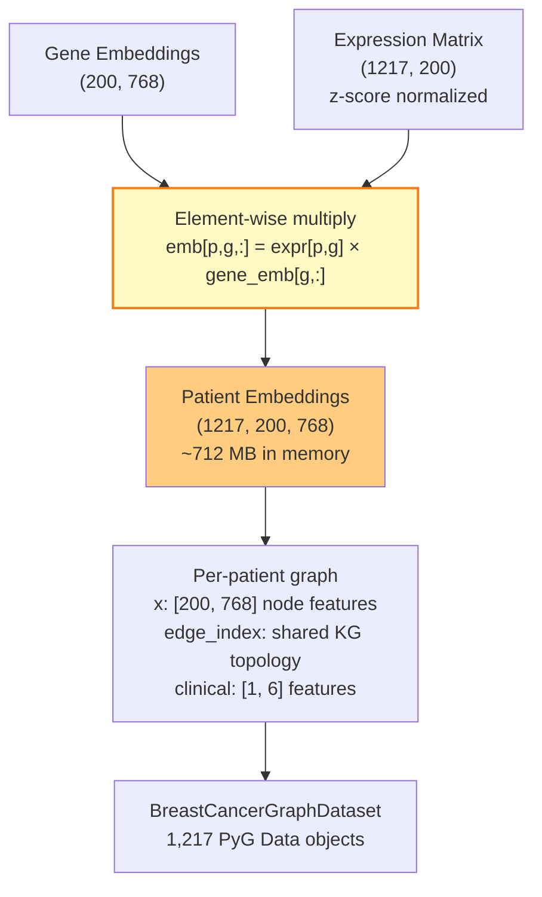
```mermaid
flowchart TD
    GE["Gene Embeddings<br/>(200, 768)"] --> MUL
    EX["Expression Matrix<br/>(1217, 200)<br/>z-score normalized"] --> MUL

    MUL["Element-wise multiply<br/>emb[p,g,:] = expr[p,g] × gene_emb[g,:]"]

    MUL --> PE["Patient Embeddings<br/>(1217, 200, 768)<br/>~712 MB in memory"]

    PE --> GRAPH["Per-patient graph<br/>x: [200, 768] node features<br/>edge_index: shared KG topology<br/>clinical: [1, 6] features"]

    GRAPH --> DS["BreastCancerGraphDataset<br/>1,217 PyG Data objects"]

    style MUL fill:#fff9c4,stroke:#f57f17,stroke-width:2px
    style PE fill:#ffcc80
```

---

## 11. Dataset Construction & SMOTE Decision

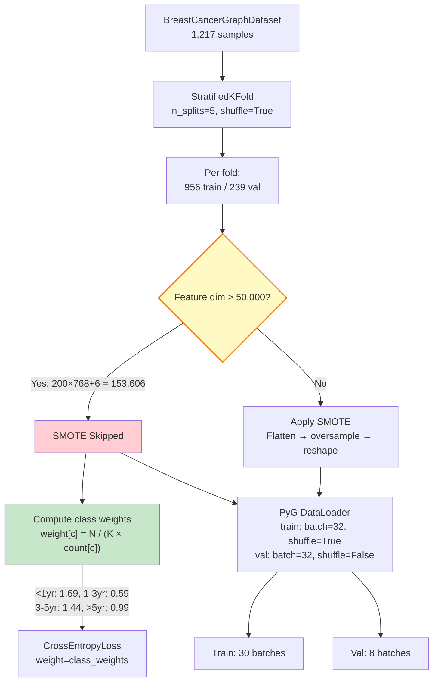
```mermaid
flowchart TD
    DS[BreastCancerGraphDataset<br/>1,217 samples] --> SPLIT[StratifiedKFold<br/>n_splits=5, shuffle=True]
    SPLIT --> FOLD["Per fold:<br/>956 train / 239 val"]

    FOLD --> SMOTE_CHK{"Feature dim > 50,000?"}

    SMOTE_CHK -->|"Yes: 200×768+6 = 153,606"| SKIP["SMOTE Skipped"]
    SMOTE_CHK -->|"No"| APPLY["Apply SMOTE<br/>Flatten → oversample → reshape"]

    SKIP --> WEIGHTS["Compute class weights<br/>weight[c] = N / (K × count[c])"]
    APPLY --> LOADER

    WEIGHTS --> |"<1yr: 1.69, 1-3yr: 0.59<br/>3-5yr: 1.44, >5yr: 0.99"| LOSS["CrossEntropyLoss<br/>weight=class_weights"]

    SKIP --> LOADER["PyG DataLoader<br/>train: batch=32, shuffle=True<br/>val: batch=32, shuffle=False"]

    LOADER --> TRAIN_DL["Train: 30 batches"]
    LOADER --> VAL_DL["Val: 8 batches"]

    style SMOTE_CHK fill:#fff9c4,stroke:#f57f17,stroke-width:2px
    style SKIP fill:#ffcdd2
    style WEIGHTS fill:#c8e6c9
```

---

## 12. GAT Model Architecture

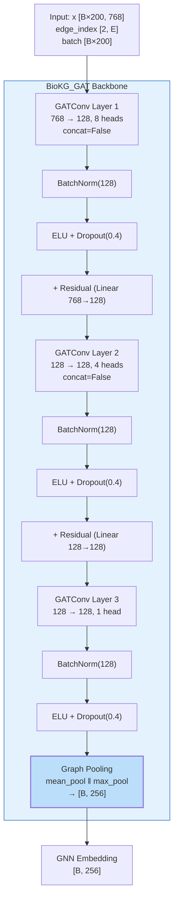
```mermaid
flowchart TD
    IN["Input: x [B×200, 768]<br/>edge_index [2, E]<br/>batch [B×200]"]

    IN --> GAT1

    subgraph GAT["BioKG_GAT Backbone"]
        GAT1["GATConv Layer 1<br/>768 → 128, 8 heads<br/>concat=False"]
        BN1["BatchNorm(128)"]
        ACT1["ELU + Dropout(0.4)"]
        RES1["+ Residual (Linear 768→128)"]

        GAT2["GATConv Layer 2<br/>128 → 128, 4 heads<br/>concat=False"]
        BN2["BatchNorm(128)"]
        ACT2["ELU + Dropout(0.4)"]
        RES2["+ Residual (Linear 128→128)"]

        GAT3["GATConv Layer 3<br/>128 → 128, 1 head"]
        BN3["BatchNorm(128)"]
        ACT3["ELU + Dropout(0.4)"]

        POOL["Graph Pooling<br/>mean_pool ‖ max_pool<br/>→ [B, 256]"]

        GAT1 --> BN1 --> ACT1 --> RES1
        RES1 --> GAT2 --> BN2 --> ACT2 --> RES2
        RES2 --> GAT3 --> BN3 --> ACT3
        ACT3 --> POOL
    end

    POOL --> OUT["GNN Embedding<br/>[B, 256]"]

    style GAT fill:#e3f2fd,stroke:#1565c0
    style POOL fill:#bbdefb,stroke-width:2px
```

---

## 13. HybridModel Forward Pass

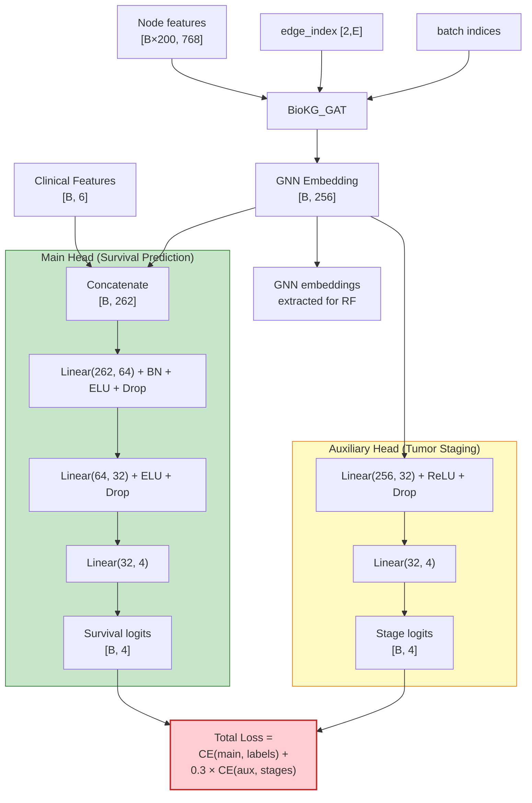
```mermaid
flowchart TD
    X["Node features<br/>[B×200, 768]"] --> GNN["BioKG_GAT"]
    EI["edge_index [2,E]"] --> GNN
    BATCH["batch indices"] --> GNN

    GNN --> EMB["GNN Embedding<br/>[B, 256]"]

    CLIN["Clinical Features<br/>[B, 6]"] --> CAT

    EMB --> CAT["Concatenate<br/>[B, 262]"]
    EMB --> AUX_HEAD

    subgraph MAIN["Main Head (Survival Prediction)"]
        CAT --> FC1["Linear(262, 64) + BN + ELU + Drop"]
        FC1 --> FC2["Linear(64, 32) + ELU + Drop"]
        FC2 --> FC3["Linear(32, 4)"]
        FC3 --> MAIN_OUT["Survival logits<br/>[B, 4]"]
    end

    subgraph AUX["Auxiliary Head (Tumor Staging)"]
        AUX_HEAD["Linear(256, 32) + ReLU + Drop"]
        AUX_HEAD --> AUX_FC["Linear(32, 4)"]
        AUX_FC --> AUX_OUT["Stage logits<br/>[B, 4]"]
    end

    MAIN_OUT --> LOSS["Total Loss =<br/>CE(main, labels) +<br/>0.3 × CE(aux, stages)"]
    AUX_OUT --> LOSS

    EMB --> RF_INPUT["GNN embeddings<br/>extracted for RF"]

    style MAIN fill:#c8e6c9,stroke:#2e7d32
    style AUX fill:#fff9c4,stroke:#f57f17
    style LOSS fill:#ffcdd2,stroke:#c62828,stroke-width:2px
```

---

## 14. Training Loop

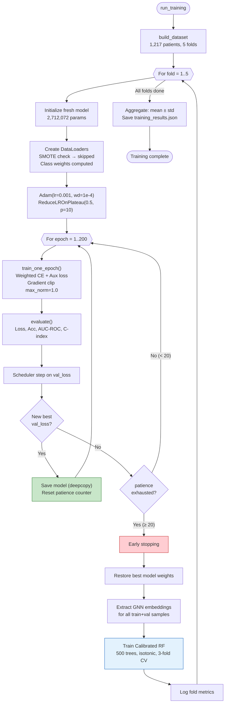
```mermaid
flowchart TD
    START([run_training]) --> BUILD[build_dataset<br/>1,217 patients, 5 folds]

    BUILD --> FOLD_LOOP{{"For fold = 1..5"}}

    FOLD_LOOP --> INIT["Initialize fresh model<br/>2,712,072 params"]
    INIT --> DL[Create DataLoaders<br/>SMOTE check → skipped<br/>Class weights computed]
    DL --> OPT["Adam(lr=0.001, wd=1e-4)<br/>ReduceLROnPlateau(0.5, p=10)"]

    OPT --> EPOCH{{"For epoch = 1..200"}}

    EPOCH --> TRAIN["train_one_epoch()<br/>Weighted CE + Aux loss<br/>Gradient clip max_norm=1.0"]
    TRAIN --> EVAL["evaluate()<br/>Loss, Acc, AUC-ROC, C-index"]
    EVAL --> SCHED["Scheduler step on val_loss"]

    SCHED --> BEST{"New best<br/>val_loss?"}
    BEST -->|Yes| SAVE["Save model (deepcopy)<br/>Reset patience counter"]
    BEST -->|No| PATIENCE{"patience<br/>exhausted?"}
    PATIENCE -->|"No (< 20)"| EPOCH
    PATIENCE -->|"Yes (≥ 20)"| EARLY["Early stopping"]

    SAVE --> EPOCH

    EARLY --> RESTORE["Restore best model weights"]
    RESTORE --> EXTRACT["Extract GNN embeddings<br/>for all train+val samples"]
    EXTRACT --> RF["Train Calibrated RF<br/>500 trees, isotonic, 3-fold CV"]
    RF --> METRICS["Log fold metrics"]
    METRICS --> FOLD_LOOP

    FOLD_LOOP -->|All folds done| AGG["Aggregate: mean ± std<br/>Save training_results.json"]
    AGG --> DONE([Training complete])

    style EARLY fill:#ffcdd2,stroke:#c62828
    style SAVE fill:#c8e6c9,stroke:#2e7d32
    style RF fill:#e3f2fd,stroke:#1565c0
```

---

## 15. Cross-Validation Strategy

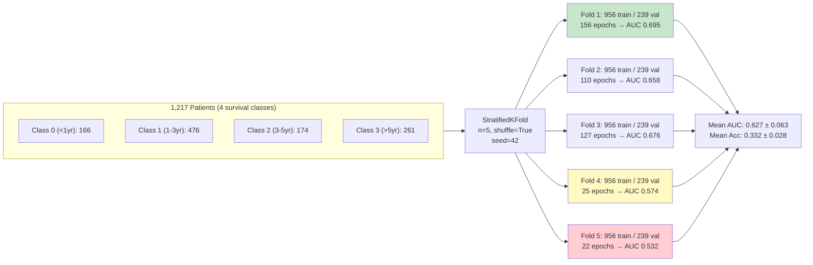
```mermaid
flowchart LR
    subgraph Dataset["1,217 Patients (4 survival classes)"]
        direction TB
        C0["Class 0 (<1yr): 166"]
        C1["Class 1 (1-3yr): 476"]
        C2["Class 2 (3-5yr): 174"]
        C3["Class 3 (>5yr): 261"]
    end

    Dataset --> SKF["StratifiedKFold<br/>n=5, shuffle=True<br/>seed=42"]

    SKF --> F1["Fold 1: 956 train / 239 val<br/>156 epochs → AUC 0.695"]
    SKF --> F2["Fold 2: 956 train / 239 val<br/>110 epochs → AUC 0.658"]
    SKF --> F3["Fold 3: 956 train / 239 val<br/>127 epochs → AUC 0.676"]
    SKF --> F4["Fold 4: 956 train / 239 val<br/>25 epochs → AUC 0.574"]
    SKF --> F5["Fold 5: 956 train / 239 val<br/>22 epochs → AUC 0.532"]

    F1 & F2 & F3 & F4 & F5 --> AGG["Mean AUC: 0.627 ± 0.063<br/>Mean Acc: 0.332 ± 0.028"]

    style F1 fill:#c8e6c9
    style F4 fill:#fff9c4
    style F5 fill:#ffcdd2
```

---

## 16. Hybrid RF Training

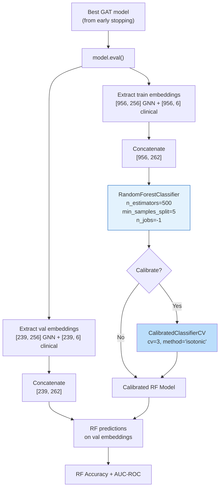
```mermaid
flowchart TD
    BEST_GAT["Best GAT model<br/>(from early stopping)"] --> EVAL_MODE["model.eval()"]

    EVAL_MODE --> EXTRACT_T["Extract train embeddings<br/>[956, 256] GNN + [956, 6] clinical"]
    EVAL_MODE --> EXTRACT_V["Extract val embeddings<br/>[239, 256] GNN + [239, 6] clinical"]

    EXTRACT_T --> CONCAT_T["Concatenate<br/>[956, 262]"]
    EXTRACT_V --> CONCAT_V["Concatenate<br/>[239, 262]"]

    CONCAT_T --> RF["RandomForestClassifier<br/>n_estimators=500<br/>min_samples_split=5<br/>n_jobs=-1"]

    RF --> CAL{"Calibrate?"}
    CAL -->|Yes| ISO["CalibratedClassifierCV<br/>cv=3, method='isotonic'"]
    CAL -->|No| RF_FINAL

    ISO --> RF_FINAL["Calibrated RF Model"]

    CONCAT_V --> PRED["RF predictions<br/>on val embeddings"]
    RF_FINAL --> PRED

    PRED --> RF_METRICS["RF Accuracy + AUC-ROC"]

    style RF fill:#e3f2fd,stroke:#1565c0
    style ISO fill:#bbdefb
```

---

## 17. Evaluation & Baselines

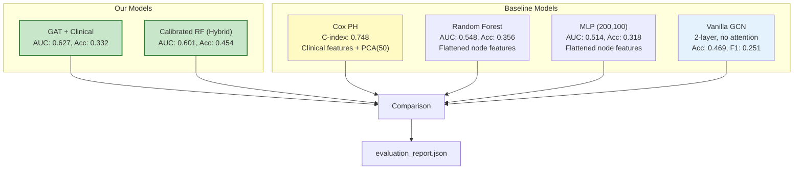
```mermaid
flowchart TD
    subgraph OUR["Our Models"]
        GAT["GAT + Clinical<br/>AUC: 0.627, Acc: 0.332"]
        RF["Calibrated RF (Hybrid)<br/>AUC: 0.601, Acc: 0.454"]
    end

    subgraph BASELINES["Baseline Models"]
        COX["Cox PH<br/>C-index: 0.748<br/>Clinical features + PCA(50)"]
        RF_BASE["Random Forest<br/>AUC: 0.548, Acc: 0.356<br/>Flattened node features"]
        MLP["MLP (200,100)<br/>AUC: 0.514, Acc: 0.318<br/>Flattened node features"]
        GCN["Vanilla GCN<br/>2-layer, no attention<br/>Acc: 0.469, F1: 0.251"]
    end

    GAT --> COMPARE["Comparison"]
    RF --> COMPARE
    COX --> COMPARE
    RF_BASE --> COMPARE
    MLP --> COMPARE
    GCN --> COMPARE

    COMPARE --> SAVE["evaluation_report.json"]

    style GAT fill:#c8e6c9,stroke:#2e7d32,stroke-width:2px
    style RF fill:#c8e6c9,stroke:#2e7d32,stroke-width:2px
    style COX fill:#fff9c4
    style GCN fill:#e3f2fd
```

---

## 18. Ablation Study

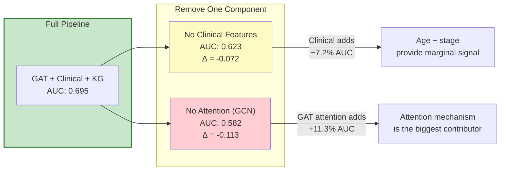
```mermaid
flowchart LR
    subgraph FULL["Full Pipeline"]
        FULL_M["GAT + Clinical + KG<br/>AUC: 0.695"]
    end

    subgraph ABLATIONS["Remove One Component"]
        NO_CLIN["No Clinical Features<br/>AUC: 0.623<br/>Δ = -0.072"]
        NO_ATT["No Attention (GCN)<br/>AUC: 0.582<br/>Δ = -0.113"]
    end

    FULL_M --> NO_CLIN
    FULL_M --> NO_ATT

    NO_CLIN -->|"Clinical adds<br/>+7.2% AUC"| INSIGHT1["Age + stage<br/>provide marginal signal"]
    NO_ATT -->|"GAT attention adds<br/>+11.3% AUC"| INSIGHT2["Attention mechanism<br/>is the biggest contributor"]

    style FULL fill:#c8e6c9,stroke:#2e7d32,stroke-width:2px
    style NO_CLIN fill:#fff9c4
    style NO_ATT fill:#ffcdd2
```

---

## 19. Explainability Pipeline

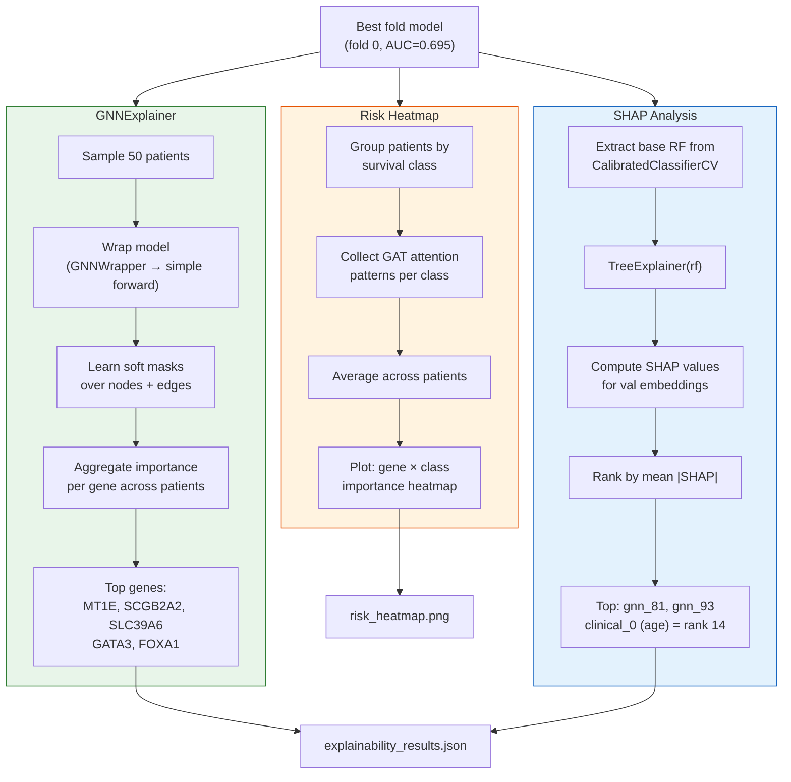
```mermaid
flowchart TD
    MODEL["Best fold model<br/>(fold 0, AUC=0.695)"] --> GNNE
    MODEL --> SHAP_A
    MODEL --> HEAT

    subgraph GNNE["GNNExplainer"]
        G1["Sample 50 patients"]
        G2["Wrap model<br/>(GNNWrapper → simple forward)"]
        G3["Learn soft masks<br/>over nodes + edges"]
        G4["Aggregate importance<br/>per gene across patients"]
        G5["Top genes:<br/>MT1E, SCGB2A2, SLC39A6<br/>GATA3, FOXA1"]

        G1 --> G2 --> G3 --> G4 --> G5
    end

    subgraph SHAP_A["SHAP Analysis"]
        S1["Extract base RF from<br/>CalibratedClassifierCV"]
        S2["TreeExplainer(rf)"]
        S3["Compute SHAP values<br/>for val embeddings"]
        S4["Rank by mean |SHAP|"]
        S5["Top: gnn_81, gnn_93<br/>clinical_0 (age) = rank 14"]

        S1 --> S2 --> S3 --> S4 --> S5
    end

    subgraph HEAT["Risk Heatmap"]
        H1["Group patients by<br/>survival class"]
        H2["Collect GAT attention<br/>patterns per class"]
        H3["Average across patients"]
        H4["Plot: gene × class<br/>importance heatmap"]

        H1 --> H2 --> H3 --> H4
    end

    G5 --> SAVE["explainability_results.json"]
    S5 --> SAVE
    H4 --> IMG["risk_heatmap.png"]

    style GNNE fill:#e8f5e9,stroke:#2e7d32
    style SHAP_A fill:#e3f2fd,stroke:#1565c0
    style HEAT fill:#fff3e0,stroke:#e65100
```

---

## 20. Visualization Outputs

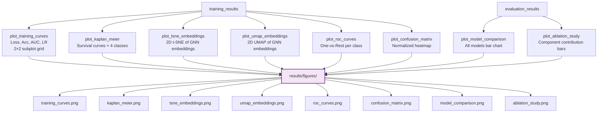
```mermaid
flowchart TD
    TR["training_results"] --> TC["plot_training_curves<br/>Loss, Acc, AUC, LR<br/>2×2 subplot grid"]
    TR --> KM["plot_kaplan_meier<br/>Survival curves × 4 classes"]
    TR --> TSNE["plot_tsne_embeddings<br/>2D t-SNE of GNN embeddings"]
    TR --> UMAP["plot_umap_embeddings<br/>2D UMAP of GNN embeddings"]
    TR --> ROC["plot_roc_curves<br/>One-vs-Rest per class"]
    TR --> CM["plot_confusion_matrix<br/>Normalized heatmap"]

    EVAL["evaluation_results"] --> MC["plot_model_comparison<br/>All models bar chart"]
    EVAL --> AB["plot_ablation_study<br/>Component contribution bars"]

    TC --> FIG["results/figures/"]
    KM --> FIG
    TSNE --> FIG
    UMAP --> FIG
    ROC --> FIG
    CM --> FIG
    MC --> FIG
    AB --> FIG

    FIG --> P1["training_curves.png"]
    FIG --> P2["kaplan_meier.png"]
    FIG --> P3["tsne_embeddings.png"]
    FIG --> P4["umap_embeddings.png"]
    FIG --> P5["roc_curves.png"]
    FIG --> P6["confusion_matrix.png"]
    FIG --> P7["model_comparison.png"]
    FIG --> P8["ablation_study.png"]

    style FIG fill:#f3e5f5,stroke:#6a1b9a,stroke-width:2px
```

---

## 21. File Artifact Map

```mermaid
flowchart TD
    subgraph RAW["data/raw/"]
        R1["tcga_brca_expression.tsv.gz"]
        R2["tcga_brca_clinical.tsv"]
    end

    subgraph KG_DIR["data/knowledge_graph/"]
        K1["string_ppi.tsv"]
        K2["string_id_mapping.tsv"]
        K3["disgenet_gene_disease.tsv"]
        K4["kg_edges.pt"]
        K5["kg_metadata.json"]
    end

    subgraph EMB_DIR["data/embeddings/"]
        E1["gene_summaries.json"]
        E2["gene_embeddings.npy"]
        E3["faiss_index.bin"]
        E4["gene_names.json"]
    end

    subgraph PROC["data/processed/"]
        P1["expression_selected.tsv"]
        P2["selected_genes.txt"]
        P3["survival_labels.tsv"]
        P4["clinical_features.tsv"]
    end

    subgraph RES["results/"]
        T1["training_results.json"]
        T2["evaluation_report.json"]
        T3["explainability_results.json"]
        T4["model_fold0..4.pt"]
        subgraph FIGS["results/figures/"]
            F1["8 PNG plots"]
        end
    end

    RAW -->|Stage 1a| KG_DIR
    RAW -->|Stage 1b| PROC
    RAW -->|Stage 1a| EMB_DIR
    KG_DIR -->|Stage 2a| EMB_DIR
    PROC & EMB_DIR & KG_DIR -->|Stage 3-4| RES

    style RAW fill:#ffcdd2
    style KG_DIR fill:#bbdefb
    style EMB_DIR fill:#c8e6c9
    style PROC fill:#fff9c4
    style RES fill:#f3e5f5
```

---

## 22. Class Distribution & Weighting

```mermaid
pie title Survival Class Distribution (1,217 patients)
    "<1 year (Class 0)" : 166
    "1-3 years (Class 1)" : 476
    "3-5 years (Class 2)" : 174
    ">5 years (Class 3)" : 261
```

```mermaid
flowchart LR
    subgraph DIST["Class Counts"]
        C0["<1yr: 166<br/>13.6%"]
        C1["1-3yr: 476<br/>39.1%"]
        C2["3-5yr: 174<br/>14.3%"]
        C3[">5yr: 261<br/>21.4%"]
    end

    subgraph WEIGHTS["Inverse-Frequency Weights"]
        W0["Class 0: 1.695"]
        W1["Class 1: 0.587"]
        W2["Class 2: 1.440"]
        W3["Class 3: 0.988"]
    end

    C0 --> W0
    C1 --> W1
    C2 --> W2
    C3 --> W3

    WEIGHTS --> CE["nn.CrossEntropyLoss<br/>(weight=tensor)"]

    style C0 fill:#ffcdd2
    style C1 fill:#c8e6c9
    style C2 fill:#fff9c4
    style C3 fill:#bbdefb
```

---

## 23. Error Handling & Fallback Strategy

```mermaid
flowchart TD
    subgraph DOWNLOAD["Data Download Fallbacks"]
        GDC_FAIL["GDC 500 Error"] -->|Fallback| XENA["UCSC Xena Mirror"]
        DISGENET_FAIL["DisGeNET API Error"] -->|Fallback| CURATED["100 Curated Genes"]
        KEGG_FAIL["KEGG API Timeout"] -->|Fallback| HARDCODED["Common Cancer Pathways"]
    end

    subgraph PREPROCESS["Preprocessing Guards"]
        NAN_COL["All-NaN Column<br/>(e.g. tumor_stage)"] -->|Guard| FILL["Fill with 0 + Warning"]
        SMALL_INTER["DisGeNET overlap < 10%"] -->|Guard| KEEP_ALL["Keep all LASSO genes"]
    end

    subgraph TRAINING["Training Guards"]
        HIGH_DIM["Features > 50,000"] -->|Guard| SKIP_SMOTE["Skip SMOTE<br/>Use class weights"]
        DIVERGE["Val loss not improving<br/>for 20 epochs"] -->|Guard| EARLY_STOP["Early stopping<br/>Restore best model"]
        GRAD_EXP["Gradient explosion"] -->|Guard| CLIP["Gradient clip<br/>max_norm=1.0"]
    end

    subgraph EMBED["Embedding Caching"]
        CACHED["gene_embeddings.npy<br/>exists?"] -->|Yes| LOAD["Load from disk (<1s)"]
        CACHED -->|No| GENERATE["Run BioBERT (~3 min)"]
        HF_PERM["~/.cache PermissionError"] -->|Fix| HF_HOME["Set HF_HOME=./.hf_cache"]
    end

    style GDC_FAIL fill:#ffcdd2
    style DISGENET_FAIL fill:#ffcdd2
    style HIGH_DIM fill:#ffcdd2
    style SKIP_SMOTE fill:#c8e6c9
    style EARLY_STOP fill:#c8e6c9
```

---

## 24. Model Comparison

```mermaid
quadrantChart
    title Model Comparison (Accuracy vs AUC-ROC)
    x-axis "Low Accuracy" --> "High Accuracy"
    y-axis "Low AUC-ROC" --> "High AUC-ROC"
    quadrant-1 "High AUC, High Acc"
    quadrant-2 "High AUC, Low Acc"
    quadrant-3 "Low AUC, Low Acc"
    quadrant-4 "Low AUC, High Acc"
    "GAT (Ours)": [0.40, 0.75]
    "Calibrated RF": [0.60, 0.65]
    "Vanilla GCN": [0.62, 0.55]
    "RF Baseline": [0.48, 0.45]
    "MLP Baseline": [0.40, 0.35]
```
