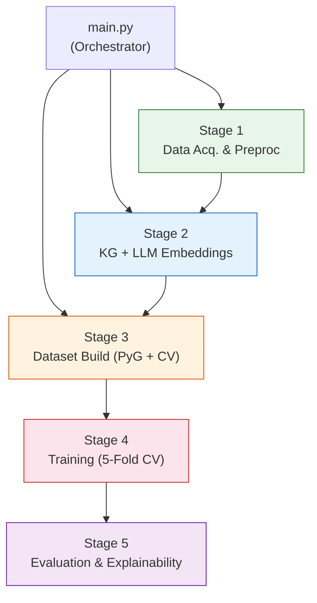
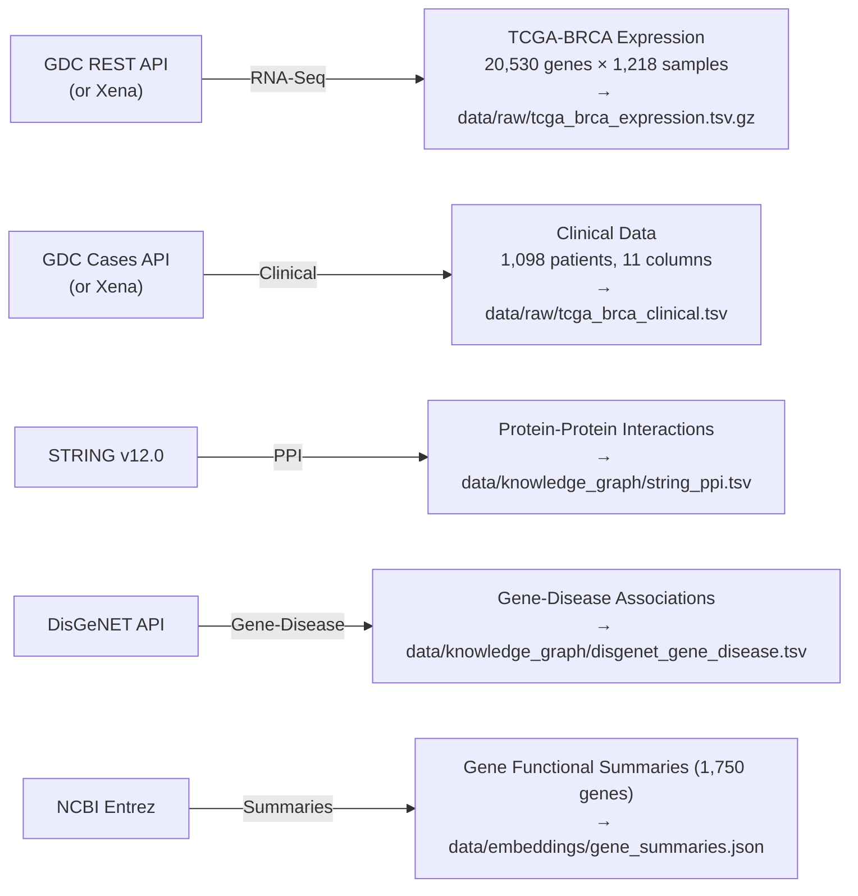
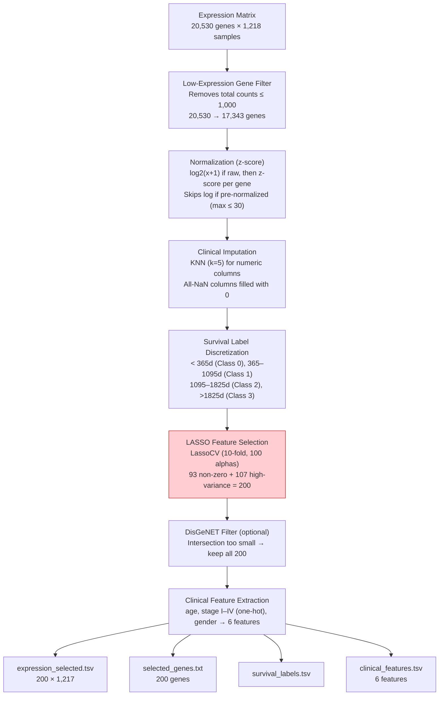
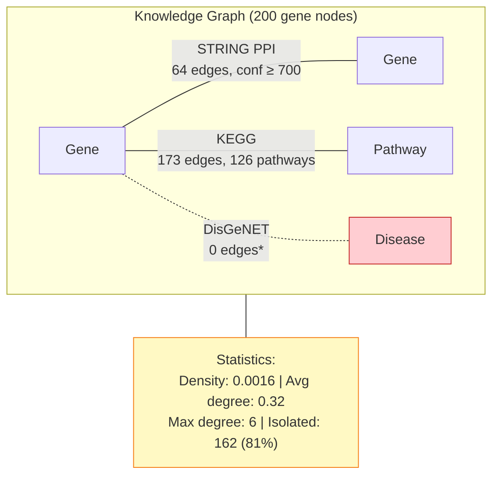
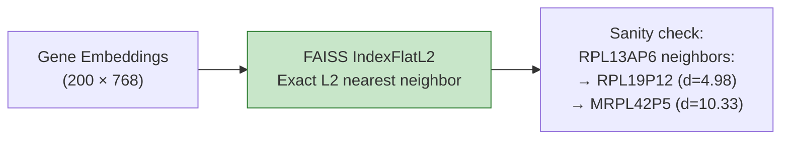
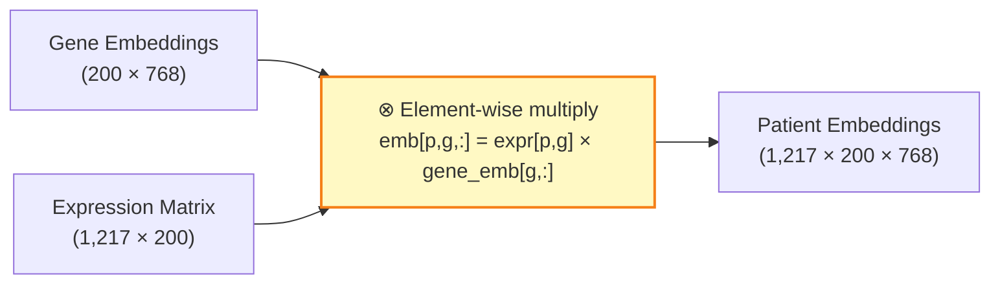
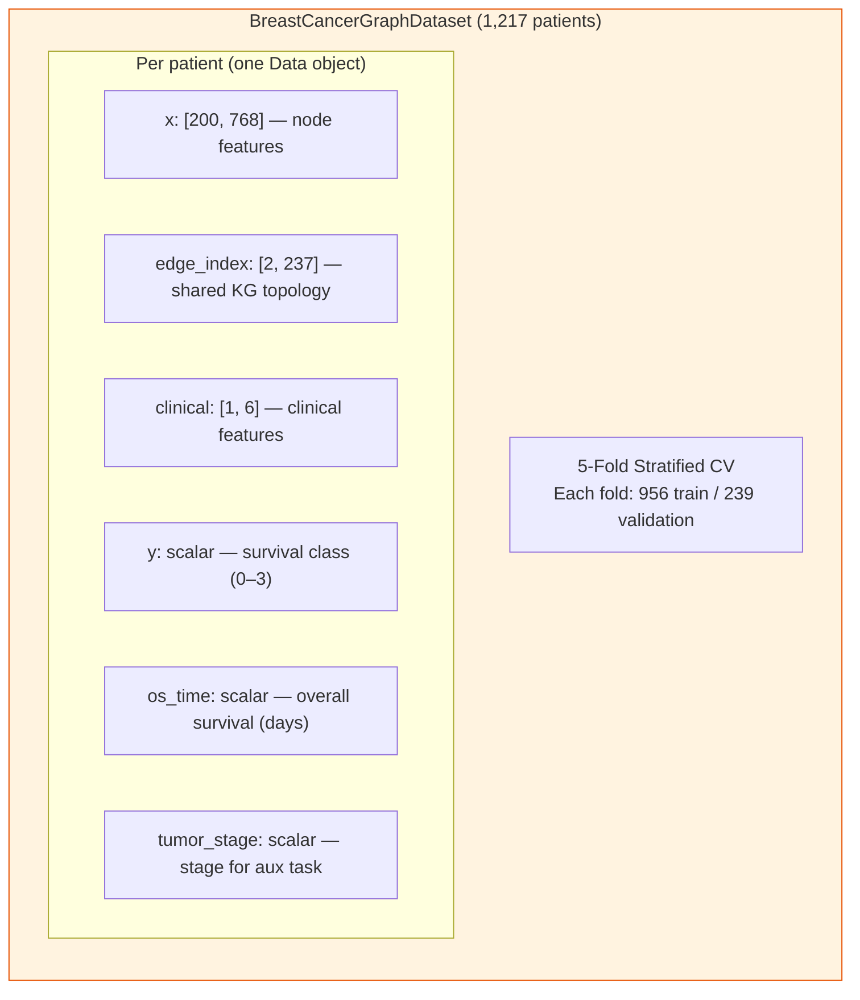
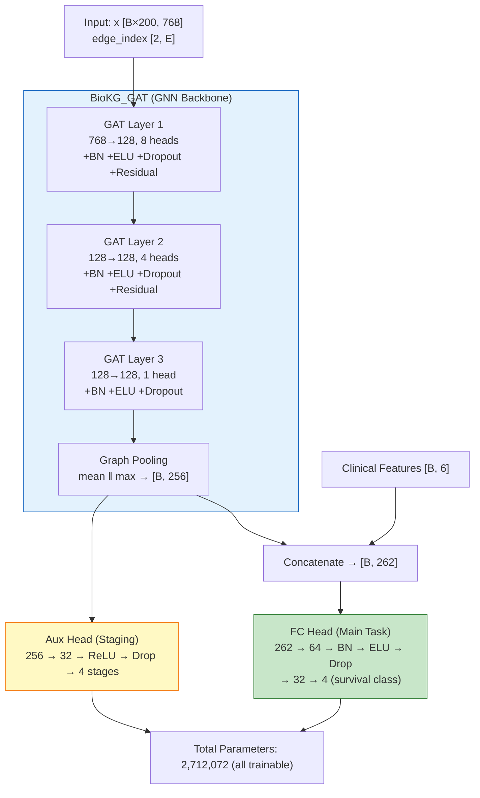
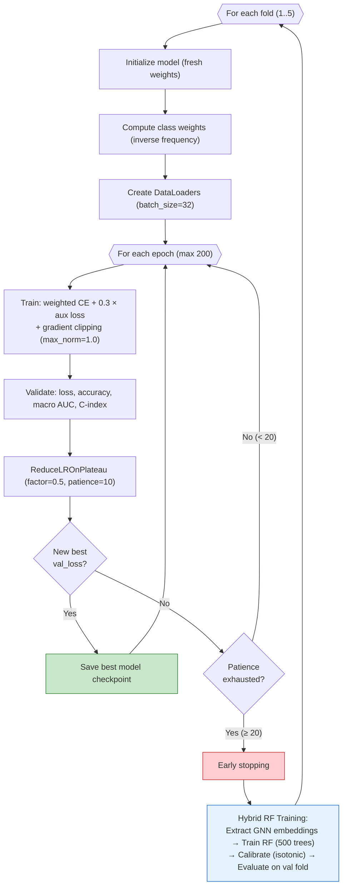
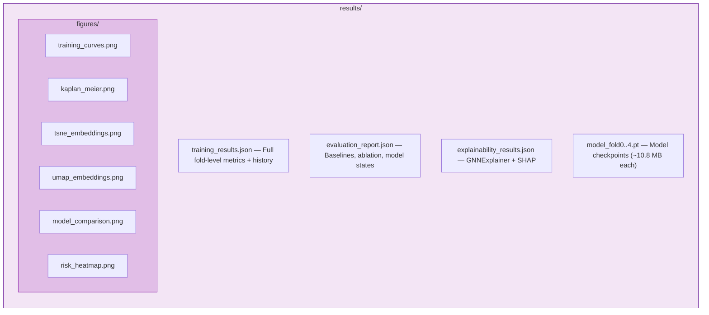

# Pipeline Documentation

This document describes each stage of the breast cancer prognosis prediction pipeline, including data flow, intermediate artifacts, and architectural decisions.

---

## End-to-End Flow



---

## Stage 1: Data Acquisition & Preprocessing

**Entry point**: `run_stage1(config)` → calls `run_data_download()` then `run_preprocessing()`

### 1a. Data Download (`src/data_download.py`)



**Fallback strategy**: GDC is the primary source. If the GDC bulk download fails (e.g., 500 error), the pipeline falls back to UCSC Xena mirrors automatically.

### 1b. Preprocessing (`src/preprocessing.py`)



**Patient matching**: TCGA sample barcodes (e.g., `TCGA-XX-XXXX-01`) are truncated to 12-character patient IDs and matched across expression and clinical data. 1,217 of 1,218 samples match successfully.

**Class distribution** after label discretization:

| Class | Time Range | Patients | Proportion |
|-------|-----------|----------|------------|
| 0 | <1 year | 166 | 13.6% |
| 1 | 1–3 years | 476 | 39.1% |
| 2 | 3–5 years | 174 | 14.3% |
| 3 | >5 years | 261 | 21.4% |

---

## Stage 2: Knowledge Graph & LLM Embeddings

**Entry point**: `run_stage2(config)` → calls `build_knowledge_graph()`, `run_embedding_generation()`, `build_gene_vector_store()`

### 2a. Knowledge Graph Construction (`src/kg_construction.py`)



\* No overlap between LASSO-selected genes and DisGeNET entries.

**Edge construction details**:
- **STRING PPI**: Loads 13.7M human protein links, filters to confidence ≥ 700, maps protein IDs to gene symbols, intersects with 200 selected genes → 64 bidirectional edges
- **DisGeNET**: Filters for "Neoplastic Process" semantic type, but no selected genes appear in the breast cancer association set → 0 edges
- **KEGG**: REST API batch query per gene; finds 126 pathways containing at least one selected gene → 173 gene-pathway membership edges

### 2b. LLM Embeddings (`src/llm_embeddings.py`)


- **Model**: `dmis-lab/biobert-base-cased-v1.2` (PubMed + PMC pre-trained BERT)
- **Input**: Gene functional summary text from NCBI (e.g., "This gene encodes a member of the...")
- **Output**: 768-dimensional `[CLS]` token embedding per gene
- **Pathway/disease embeddings**: Generated from synthetic descriptions (e.g., "KEGG pathway: Cell cycle — genes involved in cell cycle regulation")

### 2c. FAISS Vector Store (`src/vector_store.py`)



---

## Stage 3: Dataset Construction

**Entry point**: `run_stage3(config)` → calls `build_dataset()`

### Patient-Weighted Embeddings (GenePT-w)



Each patient gets a **personalized graph** where node features are the gene's BioBERT embedding scaled by that patient's expression level for that gene. This encodes both functional meaning (from the LLM) and patient-specific expression signal.

### PyTorch Geometric Dataset



**SMOTE handling**: The flattened feature dimension (200 × 768 + 6 = 153,606) exceeds the `MAX_SMOTE_FEATURES` threshold of 50,000. SMOTE is skipped and **class-weighted cross-entropy loss** is used instead for class imbalance.

---

## Stage 4: Model Training

**Entry point**: `run_stage4(config)` → calls `run_training()`

### Model Architecture



### Training Loop



### Training Progress (Fold 1 Example)

```
Epoch    1 → Train Loss: 1.385  Val AUC: 0.546  Val Acc: 0.188
Epoch   50 → Train Loss: 1.328  Val AUC: 0.609  Val Acc: 0.326
Epoch  100 → Train Loss: 1.306  Val AUC: 0.668  Val Acc: 0.335
Epoch  150 → Train Loss: 1.249  Val AUC: 0.701  Val Acc: 0.393
Epoch  156 → Early stop  Val AUC: 0.695  Val Acc: 0.372  (best)

RF Hybrid → Accuracy: 0.515  AUC: 0.678
```

---

## Stage 5: Evaluation & Explainability

**Entry point**: `run_stage5(config, training_results)` → calls `run_evaluation()`, `run_explainability()`, `generate_all_visualizations()`

### 5a. Evaluation (`src/evaluate.py`)

- **CV summary** with mean ± std across folds
- **Baseline comparisons**: Cox PH, Random Forest, MLP, Vanilla GCN
- **Ablation study**: Expression-only RF, Expression+Clinical RF, GCN with BioKG

### 5b. Explainability (`src/explain.py`)

- **GNNExplainer**: Identifies important nodes (genes) for individual predictions by learning soft masks over node features and edges
- **SHAP TreeExplainer**: Feature importance for the RF hybrid model, revealing which GNN embedding dimensions and clinical features drive predictions
- **Risk heatmap**: NetworkX graph visualization of top genes and their KG connections

### 5c. Visualization (`src/visualize.py`)

Generates 5 publication-ready figures:
1. `training_curves.png` — Loss, accuracy, and AUC/C-index curves per fold
2. `kaplan_meier.png` — Kaplan-Meier survival curves by predicted risk group
3. `tsne_embeddings.png` — 2D t-SNE projection of patient GNN embeddings
4. `umap_embeddings.png` — 2D UMAP projection of patient GNN embeddings
5. `model_comparison.png` — Bar chart comparing all models

### Output Artifacts



---

## Configuration Reference

All pipeline behavior is controlled by `configs/config.yaml`:

```yaml
data:
  tcga_project: TCGA-BRCA
  min_total_counts: 1000          # Gene filtering threshold
  n_genes_lasso: 200              # Target gene count after LASSO
  string_confidence_threshold: 700 # STRING PPI confidence cutoff
  survival_bins: [365, 1095, 1825] # Survival class boundaries (days)

model:
  gat_layers: 3                   # Number of GAT layers
  gat_heads: [8, 4, 1]           # Attention heads per layer
  hidden_dim: 128                 # GNN hidden dimension
  dropout: 0.4                    # Dropout rate
  llm_embedding_dim: 768          # BioBERT output dimension
  llm_model: "dmis-lab/biobert-base-cased-v1.2"

training:
  lr: 0.001                       # Initial learning rate
  weight_decay: 1.0e-4            # L2 regularization
  epochs: 200                     # Maximum training epochs
  patience: 20                    # Early stopping patience
  batch_size: 32                  # Mini-batch size
  cv_folds: 5                     # Cross-validation folds
  aux_loss_weight: 0.3            # Auxiliary task loss weight

hybrid:
  rf_n_estimators: 500            # Random Forest trees
  rf_calibrated: true             # Use isotonic calibration
  rf_min_samples_split: 5         # Min samples per RF split
```

---

## Reproducibility

- **Random seeds**: Set to 42 across Python, NumPy, PyTorch, and CUDA
- **Deterministic mode**: `torch.backends.cudnn.deterministic = True`
- **CV splits**: `StratifiedKFold` with fixed `random_state=42`
- **Device**: Supports CUDA, Apple MPS, and CPU (auto-detected)
