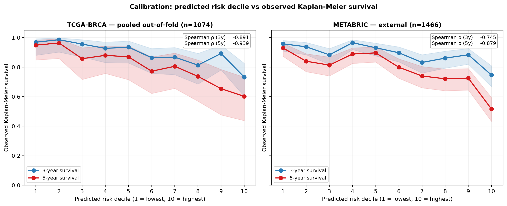

# A Leakage-Corrected, Externally-Validated Graph Neural Network for Breast Cancer Prognosis

## Per-fold leakage correction and paired-bootstrap on identical external patients as a methodological framework for GNN claims on TCGA-BRCA

**Mahdi Sarhangi**

A thesis submitted in partial fulfilment of the requirements for the degree of

**Master of Science**

Supervisor: Doç. Dr. Özgür Gümüş

Department of Computer Engineering

Ege University

2026

\newpage

# Table of Contents

**Abstract**

**Chapter 1. Introduction**

&nbsp;&nbsp;&nbsp;&nbsp;1. Background and motivation

&nbsp;&nbsp;&nbsp;&nbsp;2. The field's problem

&nbsp;&nbsp;&nbsp;&nbsp;3. Thesis position and structure

&nbsp;&nbsp;&nbsp;&nbsp;4. Roadmap

**Chapter 2. Methods**

&nbsp;&nbsp;&nbsp;&nbsp;1. Data

&nbsp;&nbsp;&nbsp;&nbsp;2. Baselines

&nbsp;&nbsp;&nbsp;&nbsp;3. Architecture

&nbsp;&nbsp;&nbsp;&nbsp;4. Ablation knobs

&nbsp;&nbsp;&nbsp;&nbsp;5. Methodological backbone

&nbsp;&nbsp;&nbsp;&nbsp;6. External validation protocol

&nbsp;&nbsp;&nbsp;&nbsp;7. Computational details

**Chapter 3. Results**

&nbsp;&nbsp;&nbsp;&nbsp;1. Cox PH baselines and the prior-pipeline correction

&nbsp;&nbsp;&nbsp;&nbsp;2. Internal TCGA — knob A vs Cox PH baselines

&nbsp;&nbsp;&nbsp;&nbsp;3. External METABRIC — knob A vs matched Cox PH

&nbsp;&nbsp;&nbsp;&nbsp;4. Architectural ablations — knob B and knob C

&nbsp;&nbsp;&nbsp;&nbsp;5. Pathway-level interpretability artifact

&nbsp;&nbsp;&nbsp;&nbsp;6. Robustness checks

**Chapter 4. Discussion**

&nbsp;&nbsp;&nbsp;&nbsp;1. Two coordinate findings

&nbsp;&nbsp;&nbsp;&nbsp;2. External paired-bootstrap as the load-bearing comparator

&nbsp;&nbsp;&nbsp;&nbsp;3. The small but stable gene-graph contribution

&nbsp;&nbsp;&nbsp;&nbsp;4. What did not work and why

&nbsp;&nbsp;&nbsp;&nbsp;5. Limitations

&nbsp;&nbsp;&nbsp;&nbsp;6. Future work

&nbsp;&nbsp;&nbsp;&nbsp;7. Contribution restated

**Chapter 5. Conclusion**

\newpage

\newpage

# Abstract

Graph neural networks are increasingly applied to cancer prognosis from
gene expression, but published comparisons commonly combine within-cohort
gene selection with within-cohort evaluation, which inflates apparent
gains over linear baselines. We present a leakage-corrected, pathway-interpretable GraphSAGE for TCGA-BRCA
survival using per-fold LASSO gene selection on training partitions only,
biological-prior gene topology from STRING PPI edges, and Cox partial-likelihood
loss with clinical late-fusion. On TCGA-BRCA (n = 1074), the model matches the
strongest Cox PH baseline internally and beats matched Cox PH on external
METABRIC validation (n = 1466, 824 events) with paired-bootstrap significance:
Δ = +0.053, 95% CI [+0.031, +0.076], P < 0.001 over 2000 resamples. Two
architectural elaborations — Reactome pathway pooling and BioBERT-derived
gene priors — significantly underperform the minimal architecture on external
validation despite competitive internal performance (paired Δ = −0.016 and
−0.039 respectively, both with CI strictly below zero), demonstrating that
complexity-driven gains require external paired-bootstrap testing to verify.
Methodological contributions: (i) a per-fold LASSO leakage audit revealing the
prior pipeline's 0.748 C-index as a full-cohort-selection artifact, and (ii)
a paired-bootstrap framework on identical external patients that
distinguishes harmful elaborations from genuine improvements. Limitation: the underlying
gene universe was full-cohort-selected; full correction would require per-fold
knowledge-graph rebuilds.

\newpage

# Introduction

## 1. Background and motivation

Breast cancer prognosis from gene expression has become a standard
application of graph neural networks, but the field's evaluation of GNN
claims has not kept pace with the architectures it evaluates. This
thesis is a methodological response: it builds a leakage-corrected
graph neural network for breast-cancer survival prediction on TCGA-BRCA
and evaluates it under a framework — per-fold leakage correction during
training plus paired-bootstrap on identical external patients during
evaluation — that resolves architectural comparisons the field's current
within-cohort assessment cannot.

Breast cancer is heterogeneous at the molecular level. The intrinsic
molecular subtypes (luminal A, luminal B, HER2-enriched, basal-like)
identified through hierarchical clustering of expression profiles
(Sørlie et al., 2001) are prognostically distinct in ways that
clinical staging alone does not capture. Hormone-receptor status (ER
and PR) and HER2 amplification status are routinely measured and carry
substantial prognostic information; SEER population data show ER-positive
disease consistently associated with longer survival than ER-negative
disease at matched stage (Howlader et al., 2014). Tumor-Node-Metastasis
staging captures the spread of disease at diagnosis but does not capture
the molecular heterogeneity that contributes to outcome divergence
within stage strata. Computational models that integrate transcriptomic
information with clinical staging therefore have a clear motivation:
better stratification of within-stage prognostic risk, with downstream
implications for treatment intensity and follow-up frequency.

Survival analysis as a discipline is built around the Cox proportional-
hazards model (Cox, 1972), which estimates hazard ratios from a
linear combination of covariates without requiring the baseline hazard
to be specified. Time-to-event prediction with right-censoring — patients
whose follow-up ends before an event is observed — is the structural
property that distinguishes survival data from standard regression
or classification, and Cox PH handles censoring through the partial
likelihood. The concordance index introduced by Harrell et al. (1982),
which measures the fraction of patient pairs whose predicted-risk
ordering agrees with their observed event ordering, is the standard
performance metric in survival prediction and the metric this thesis
reports throughout.

Computational models for survival prediction from high-dimensional
gene-expression data face two challenges that linear Cox PH alone does
not address: dimensionality (a typical RNA-seq matrix has tens of
thousands of genes against hundreds to thousands of patients) and
non-linearity (gene effects on outcome interact in ways linear models
cannot capture). The standard solutions are gene selection — most
commonly via the LASSO regression introduced by Tibshirani (1996), which
shrinks irrelevant coefficients to zero — and non-linear extensions of
the Cox PH framework. Katzman et al. (2018) introduced DeepSurv, the
first widely-adopted deep-learning Cox PH variant, which preserves the
partial-likelihood loss while replacing the linear hazard combination
with a neural network. The architecture this thesis builds is a graph-
based DeepSurv variant in this lineage.

Graph neural networks have become the field's preferred relational
architecture for cancer prognosis because gene-gene interactions are
naturally graph-structured: protein-protein interaction networks,
gene-pathway memberships, and co-expression correlations all define
edges over a shared gene-node universe. The GraphSAGE inductive variant
(Hamilton et al., 2017) — which learns aggregation functions over local
neighborhoods rather than memorizing positions in a fixed graph — is the
standard backbone choice for cohort-spanning prognosis tasks where
inference on new patients without retraining is required (Madanipour et
al., 2024). The patient-as-graph paradigm in which each patient is
represented as a graph with shared topology and patient-specific node
features (Vaida et al., 2025) makes the architecture compatible with
external-cohort inference whenever the source-cohort gene universe
intersects with the target-cohort assay coverage. The architecture's
known failure modes on small per-fold gene subgraphs — particularly
oversmoothing at depth (Ling et al., 2022) — constrain the design space
to shallow models, with two-layer GraphSAGE the consensus default.

Graph neural networks are now widely applied to cancer prognosis on
TCGA-BRCA and adjacent cohorts. The question is no longer whether to
use GNNs but how to evaluate the claims they generate. The next section
examines two specific aspects of how the field currently does that
evaluation.

---

## 2. The field's problem

The proliferation of GNN architectures for cancer prognosis has outpaced
the methodological scrutiny applied to their comparisons. Two recent
reviews of cancer-AI evaluation practice argue that external validation
should be a default expectation rather than an optional addition; both
observe that within-cohort lifts have been treated as sufficient
evidence of architectural superiority more often than they should be
(Liang, 2025; Vavekanand and Liang, 2026). This thesis works on two
specific gaps the reviews identify: gene-selection leakage at the
training stage, and lift-attribution conflation at the comparison stage.

The first gap is methodological. When a gene-selection step (LASSO,
recursive feature elimination, mutual information, or similar) is fit
on the full source cohort and cross-validation folds are constructed
afterwards for evaluation, every fold's validation patients have already
participated in the gene selection. The genes retained are partly chosen
because they correlate with those validation patients' labels. Cox PH
and GNN models built on such gene sets inherit this leakage; the
resulting C-indices are upper bounds on what the same architecture
would deliver if gene selection were re-fit per fold. The standard
correction is per-fold refit of the selection step (Tibshirani, 1996,
in the LASSO case): each fold's training partition fits its own gene
set without seeing its validation patients. The correction is not always
applied. This thesis quantifies the leakage cost on the inherited
TCGA-BRCA pipeline at +0.070 C-index between leaky and per-fold-honest
Cox PH baselines (Methods §5.1, Results §1), with the corrected
baseline becoming the methodological north-star against which all
subsequent claims are measured.

The second gap is interpretive. When a GNN reports a headline C-index
lift over a Cox PH baseline, the lift is typically attributed to the
GNN's relational inductive bias — the gene graph itself. But Cox PH
operates on a small set of clinical features and a low-dimensional
projection of expression, while the GNN has access to the same clinical
features through its head and adds non-linear capacity. A headline
GNN-vs-Cox lift therefore conflates two distinct contributions:
gene-graph contribution from the relational architecture, and
non-linear-flat-feature contribution from having a more flexible head
on the same clinical features. Decomposing the two requires a non-linear
MLP reference operating on the same clinical features without the gene
graph; this reference is rarely reported. Where clinical-fusion ablation
has been conducted with appropriate controls — Gao et al. (2021)'s
gene-only versus gene-plus-clinical comparison being one of the few
clean examples — the clinical contribution has been substantial. The
absence of the MLP-clinical reference in most GNN-on-omics papers means
that headline lifts conflate two contributions of very different
magnitudes.

External validation, when present, often uses platform-similar cohorts
that do not stress-test cross-platform transfer. TCGA-BRCA paired with
METABRIC (Curtis et al., 2012) is one of the few publicly available
source-target combinations that does: TCGA is RNA-seq, METABRIC is
Illumina microarray, the platforms differ in dynamic range and probe
coverage, and METABRIC's longer follow-up window yields a substantially
higher event count (824 events on 1,466 patients) than TCGA's (150 on
1,074). The pair gives paired-bootstrap tests sufficient statistical
power to resolve small architectural effects that within-TCGA
comparisons cannot. The cohorts are not novel as source-target choices;
what is missing is the methodological framework that uses them
rigorously.

---

## 3. Thesis position and structure

This thesis builds a leakage-corrected GraphSAGE for TCGA-BRCA prognosis,
evaluates it on METABRIC with paired-bootstrap on identical external
patients, and decomposes the resulting lift against a non-linear MLP-
clinical reference. The methodological framework comprises per-fold
leakage correction during training and paired-bootstrap on identical
external patients during evaluation. The architecture and preprocessing
build on an inherited TCGA-BRCA pipeline; the inheritance's leakage
characteristics are audited and corrected per fold.

The thesis has three operational components. The model is a two-layer
GraphSAGE on per-patient gene graphs with STRING protein-protein-
interaction edges, per-fold LASSO gene selection within the inherited
universe, clinical late-fusion, an MLP head, and Cox partial-likelihood
loss; the architecture is held minimal as a deliberate discipline so
that ablation results are interpretable. The comparator — paired-
bootstrap on identical external patients — is the framework's primary
methodological move: by scoring two models on the same resampled
patient set with identical (T, E) pairs in equal sample sizes, the test
eliminates the patient-fold-assignment variance that fold-mean
averaging leaves uncontrolled, and resolves architectural comparisons
that internal validation alone leaves underpowered. The decomposition
introduces a non-linear MLP-clinical-only reference: a two-layer MLP
on the same clinical features with the same Cox loss, no gene graph,
which establishes the flat-feature ceiling against which the gene-graph
contribution can be honestly measured. The inductive paradigm follows
Madanipour et al. (2024), which provides the cohort-spanning inference
property the framework requires.

The framework produces two coordinate findings. The first is that a
leakage-corrected GraphSAGE matches the strongest available Cox PH
baseline on TCGA-BRCA internally and beats matched Cox PH on external
METABRIC validation with paired-bootstrap significance (Δ = +0.053,
95% CI [+0.031, +0.076], P < 0.001 over 2,000 resamples on n = 1,466
patients with 824 events). The lift is measurable but moderate: against the leakage-corrected
Cox PH baseline, the headline +0.060 C-index lift is genuine, with
approximately +0.010 attributable to the gene graph itself and the
remainder to the non-linear MLP head's use of clinical features. The
+0.010 gene-graph contribution is small but stable to within bootstrap
noise across all three GNN variants tested.

The second finding is that two architectural elaborations from the
field's recent design space — Reactome pathway pooling (Choudhry et
al., 2025) and BioBERT-PCA gene priors (Lee et al., 2020; Chen and Zou,
2023) — significantly underperform the minimal architecture on external
validation despite competitive internal performance, with paired
deltas versus the minimal architecture of −0.016 and −0.039 respectively,
both with 95% CIs strictly below zero on identical METABRIC patients.
Internal-only assessment treats both elaborations as competitive; the
external paired-bootstrap test resolves them as significantly worse.
The finding generalizes: added complexity in this design space requires
external paired-bootstrap testing to verify, and within-cohort numbers
alone are insufficient to support architectural claims at this cohort
size and event count.

The methodological framework is the thesis's contribution. The model
and the decomposition are necessary supports for the comparator to do
its work; the comparator is what transforms within-cohort architectural
comparisons from inflated point estimates into resolvable findings.
Both findings — the positive Finding 1 and the negative Finding 2 —
are joint outputs of the same framework, demonstrations of what the
framework permits and what it refuses. The framework is reusable
beyond the present task: per-fold leakage correction at the gene-
selection step plus paired-bootstrap on identical target-cohort
patients applies to any prognosis study where a source cohort and a
sufficiently-evented target cohort exist.

This thesis asks what a leakage-corrected GNN's lift over Cox PH on
TCGA-BRCA prognosis actually contains, and which architectural
elaborations from the field's recent design space survive external
paired-bootstrap testing. The remainder of the thesis is organised as
follows.

---

## 4. Roadmap

**Methods** establishes the data, the three baselines, the architecture,
the ablation knobs, the methodological apparatus (LASSO leakage audit,
bootstrap CI machinery, paired-bootstrap-vs-fold-mean worked example,
embedding-collapse and pathway-sparsity sentinels), the external
validation protocol, and the computational details.

**Results** presents the Cox PH baselines and the prior-pipeline
correction; the within-TCGA knob-A-versus-Cox-PH comparison; the
external METABRIC paired-bootstrap result with risk-stratified Kaplan-
Meier curves and decile-binned calibration; the architectural-ablation
forest plot showing knob B and knob C significantly underperforming
externally; the pathway-attention interpretability artifact; and the
robustness checks.

**Discussion** restates the two coordinate findings, argues for
external paired-bootstrap as the load-bearing comparator with knob C as
the worked example, presents the small-but-stable +0.010 gene-graph
contribution as a finding in its own right, documents the three
negative findings with mechanism and generalization, names three
limitations, lists six future-work items, and closes with the
framework restated as the thesis's contribution.

**Conclusion** summarises in a single tight paragraph: what was done,
what was found, what comes next. The framework's reusability and the
boundedness of the gene-graph signal are the chapter's two final
emphases.

\newpage

# Methods

This chapter describes the data, comparators, model, ablation knobs, and
methodological apparatus used to evaluate a graph neural network for
breast-cancer survival prediction on TCGA-BRCA with external validation on
METABRIC. The presentation is reader-needs ordered: each section depends only
on those above it, and a reader proceeding top-to-bottom should not need to
forward-reference. The narrative of how the design evolved across iterations
is recorded in the supplementary retrospectives; what follows is the
final pipeline.

## 1. Data

### 1.1 Cohorts

The internal cohort is TCGA-BRCA (The Cancer Genome Atlas — Breast Invasive
Carcinoma). Of 1,095 patients with HTSeq read counts and clinical records,
21 were excluded for non-positive overall-survival time (OS.time ≤ 0),
leaving n = 1,074 with an event rate of 0.140 (150 deaths). Survival times
are recorded in days; in addition to the continuous (T, E) representation
used for Cox partial-likelihood loss, each patient was assigned to one of
four survival classes (<1y, 1–3y, 3–5y, >5y) used as the LASSO regression
target during gene selection.

The external cohort is METABRIC (Molecular Taxonomy of Breast Cancer
International Consortium), retrieved from the cBioPortal datahub via Git
LFS. Of 2,509 patients in the source release, 1,466 were retained after
filtering on valid OS_MONTHS and valid TUMOR_STAGE; the event rate is
0.561 (824 deaths), reflecting METABRIC's substantially longer follow-up
(median 118 months vs TCGA's 28). OS_MONTHS was converted to days using
30.4375 days per month for cross-cohort consistency.

### 1.2 Gene universe

A 769-gene candidate set, hereafter the *769-gene universe*, was
inherited from the prior preprocessing pipeline. This set was originally
selected by `LassoCV` on the full 1,074-patient cohort regressing the
four-bin survival_class on log-z-normalized expression, then trimmed to
genes with edges in the constructed STRING knowledge graph. Because this
selection used full-cohort labels, it constitutes label leakage at the
gene-universe level, which the present work documents and partially
corrects (§5.1) but does not fully undo. The gene-universe limitation is
stated up front: knob A's per-fold LASSO refit operates *within* the
769-gene universe rather than on the raw 60k-gene matrix, because
attempting the latter produces per-fold subgraphs of 6 edges or fewer
(§5.1) and is intractable for the GNN. Future work that rebuilds the
STRING knowledge graph per fold would lift this limitation.

The gene-graph topology is the STRING protein-protein-interaction network
at high-confidence threshold (combined score ≥ 700; Szklarczyk et al.,
2023), restricted to the 769-gene universe. This produces 49,674
undirected gene-gene edges. The same edge set is shared across all
patients; per-patient variation enters through node features (expression).

### 1.3 Clinical features

Ten TCGA clinical features were retained for internal-only analyses:
age (z-scored), stage_ordinal (0–1 normalized), one-hot stage indicators
(stage_I/II/III/IV), is_female, and three IHC receptor-status columns
(er_signed, pr_signed, her2_signed). The legacy preprocessed file
provided er_signed and pr_signed as all-zero columns — a preprocessing
artifact inherited from the prior pipeline. The three receptor-status
columns were recovered from the cBioPortal legacy `brca_tcga` patient
file (`ER_STATUS_BY_IHC`, `PR_STATUS_BY_IHC`, `IHC_HER2`) and mapped to
signed integers (Positive → +1, Negative → −1, Indeterminate or
unavailable → 0). Recovery covered 1,094 of 1,095 patients; the
recovered features have variances of 0.68, 0.85, and 0.53 respectively,
all comfortably above the 0.01 low-variance filter that previously
dropped the all-zero columns.

For external-validation comparability, a 3-feature subset (age,
stage_ordinal, is_female) was used in any TCGA → METABRIC comparison. The
restriction is per-cohort common-denominator and is reported as such; full
within-TCGA results use the 10-feature variant.

### 1.4 Splits

Stratified 5-fold cross-validation was used throughout, with stratification
on the joint variable (survival_class × OS event). Joint stratification is
necessary because at TCGA-BRCA's 86% censoring rate and four-bin imbalance,
random folds produce wildly unequal per-fold event distributions, breaking
the well-conditioning of Cox partial-likelihood fits. Splits were generated
once with `seed=42` and saved to `data/processed/cv_splits.json`; every
result reported here uses these same splits, making all comparisons
paired-fold by construction.

### 1.5 Scope

This thesis reports on knob A as the frozen architecture and knobs B and C
as planned ablation rows. Earlier intermediate variants (notably knob D, a
precursor without leakage correction) are documented in the supplementary
retrospectives. Architectures explicitly considered and excluded — graph
attention networks (GAT), heterogeneous graph transformers, retrieval-
augmented variants, multi-omics extensions, multi-task auxiliary heads —
are addressed in the Discussion's future-work section.

## 2. Baselines

Three baselines are reported throughout, each occupying a distinct role.
The triple-baseline structure is itself a methodological choice: a single
Cox PH comparator invites the question of whether the easiest one was
chosen, and the leaky-vs-honest distinction is load-bearing for every
result that follows.

**Cox PH HONEST (north-star, 0.6662 ± 0.054).** The methodologically
defensible Cox proportional-hazards baseline. Per fold, `LassoCV` was
refit on the raw 60,660-gene HTSeq matrix using only that fold's training
patients (with the same `survival_class` regression target as the prior
pipeline), producing a per-fold gene set of 61–282 genes. PCA(100) of the
per-fold-z-normalized expression of those genes plus the 10 clinical
features were fit by `CoxPHFitter` with ridge penalizer 0.5 (Davidson-
Pilon 2019). Ridge was selected by sweeping {0.001, 0.01, 0.1, 0.5, 1, 2, 5}
and choosing the value that minimised cross-fold standard deviation
without sacrificing mean C-index. The honest baseline is the threshold
the present work must clear to claim methodological progress.

**Cox PH LEAKY (upper bound, 0.7362 ± 0.017).** The same Cox PH formulation
applied to the 769-gene leaky universe. Reported as an upper bound because
its gene selection peeked at every patient's label including those in
val folds. The +0.070 c-index gap between LEAKY and HONEST is the leakage-
audit's headline cost (§5.1). Subsequent results are interpreted against
HONEST; LEAKY is reported for context and as a sanity check that the
preprocessing reproduces the prior pipeline's number.

**Prior `0.748` figure debunked.** The legacy pipeline reported a Cox PH
C-index of 0.748. A diagnostic configuration sweep
(`scripts/00_baseline_diag.py`) over n_components ∈ {20, 50, 100, 200} and
penalizer ∈ {0.001, 0.01, 0.1, 0.5, 1, 2, 5}, with and without clinical
features, did not reproduce 0.748 with any sensible configuration. The
prior figure was traced to a non-standard feature construction (mean
across the BioBERT 768-dimensional embedding axis followed by selection
of the first 50 columns in storage order, with `penalizer=0.1`) that
does not correspond to Cox PH on a defensible feature set. The 0.748
number is treated as non-reproducible and excluded from comparisons.

**MLP clinical-only (non-linear flat-feature reference, 0.7158 ± 0.034).**
A two-layer MLP (Linear-128 → ReLU → Dropout-0.4 → Linear-1) on the
10-clinical-feature vector trained with the same Cox partial-likelihood
loss and same optimization schedule as the GNN. This baseline disentangles
"non-linear use of clinical features" from "gene-graph signal": without
it, any GNN lift over linear Cox PH HONEST conflates the two. Reporting
this reference separates the gene-graph contribution from the non-linear-
clinical contribution to the GNN's overall lift.

## 3. Architecture

The model takes a per-patient gene graph as input and outputs a scalar
log-hazard. The architecture, denoted knob A, is held fixed across all
internal and external evaluations; knobs B and C (§4) modify single
elements of it as ablation rows.

**Per-patient gene graph.** Each patient is represented as a graph in
which nodes are genes from a per-fold LASSO subset of the 769-gene
universe (§5.1), edges are the corresponding subset of STRING PPI edges
(§1.2), and node features are scalar z-normalized expression values
(in_dim = 1). The patient-as-graph paradigm with shared topology and
patient-specific node features follows Vaida et al. (2025) and Gao et al.
(2021); the inductive choice — same topology across train, val, and
external inference — is required for cold METABRIC inference without
retraining, following Madanipour et al. (2024).

**Backbone.** Two GraphSAGE convolution layers (Hamilton et al., 2017),
each producing a 128-dimensional hidden representation, with mean
neighborhood aggregation, ReLU activation, and dropout at p = 0.4
between layers. Two layers were selected to provide two-hop neighborhood
reach while avoiding the oversmoothing pattern Ling et al. (2022)
documented in deeper GNNs on small graphs of this scale (39–72 nodes per
fold). Mean aggregation was preferred over attention
because the prior attempt's GAT backbone collapsed at random initialization
across folds; SAGE with mean aggregation is initialization-stable on this
graph size, as confirmed by the embedding-collapse sentinel (§5.4).

**Pooling.** Global mean pool over the per-fold gene set produces a
patient embedding in R^128. The pool is unweighted; pathway-attention
pooling is reserved for knob B (§4) as an ablation row, not adopted in the
default architecture.

**Clinical late-fusion.** The patient embedding is concatenated with the
clinical feature vector (10-dim internally, 3-dim for METABRIC-compatible
comparisons) before the MLP head. Late fusion replicates the design of
Gao et al. (2021), whose ablation showed clinical contributing measurable
lift in TCGA prognosis. Concatenation rather than FiLM-style conditioning
or early fusion was chosen for transparency: the clinical contribution is
isolable and can be measured directly via the clinical-only MLP reference.

**Head and loss.** A two-layer MLP (Linear-128 → ReLU → Dropout-0.4 →
Linear-1) maps the fused vector to a scalar log-hazard. Training optimizes
the Cox partial-likelihood loss (Cox 1972) in its Breslow tie-handled
form, computed via `torch.logcumsumexp` for numerical stability; a single
forward pass produces predicted log-hazards for the entire batch, and the
risk-set sum is computed by sorting batch members by descending T. This
follows the DeepSurv formulation (Katzman et al., 2018).

**Optimization.** Adam optimizer (Kingma and Ba, 2015), learning rate
1e-3, weight decay 1e-4, batch size 64, 30 epochs. The model with the
highest validation C-index across the 30 epochs is retained per fold.
Validation C-index is computed on each fold's held-out 20% partition.
Per-fold seeds are 42 + fold for both NumPy and PyTorch.

## 4. Ablation knobs

Knobs B and C are ablation rows designed to test specific hypotheses
about which architectural elements contribute discriminative signal. Each
knob varies exactly one element relative to knob A; all other choices
(per-fold LASSO gene set, edge set, training schedule, clinical fusion,
MLP head) are held fixed. The hypothesis-prediction-result reporting
structure (Vavekanand and Liang, 2026) frames negative results as
informative rather than as failed attempts.

**Knob B (Reactome pathway pooling).** *Hypothesis:* biological-pathway
grouping of gene-level embeddings adds discriminative signal beyond global
mean pool. *Prior prediction:* positive effect on C-index, with the
additional benefit of clinically-interpretable attention weights, motivated
by Choudhry et al. (2025) and Vaida et al. (2025). *Construction:* after
the two SAGE layers, gene-node embeddings are aggregated per Reactome
pathway by mean over those genes belonging to the pathway (membership
matrix from MSigDB Reactome subset). Single-head dot-product attention
with a uniform-init query (zero vector, so softmax over scores is uniform
before training) weights pathway representations into the patient
embedding. The R5 sparsity sentinel (§5.4) drops pathways with fewer than
three fold genes; the design-doc's threshold of five was lowered because
per-fold gene sets of 39–72 leave 0–4 pathways at threshold five (zero is
degenerate). At threshold three, 5–19 pathways are retained per fold.

**Knob C (BioBERT-derived gene priors).** *Hypothesis:* LLM-derived gene
priors capture biological context that scalar expression alone misses,
adding unique information to per-gene node features. *Prior prediction:*
small positive effect on C-index, motivated by Chen and Zou (2023), who
reported that GenePT (GPT-3.5) gene embeddings outperformed BioBERT and
expression-trained foundation models on gene-gene tasks; BioBERT was
chosen here as the cached available alternative. *Construction:* BioBERT
768-dimensional embeddings (Lee et al., 2020) for each gene in the 769-gene
were projected to 32 dimensions by PCA fit on the gene set only (no
patient labels). The per-gene node feature is the multiplicative
combination `expression_z[patient, gene] × biobert_pca32[gene]` (in_dim =
32), not concatenation; the multiplicative form preserves the convention
that absent expression yields zero contribution. The SAGE backbone
operates on the 32-dimensional input; all other architectural elements
match knob A.

**Comparator.** Each knob's primary acceptance test is paired-bootstrap
delta on identical val patients against knob A, evaluated on both TCGA
internally and METABRIC externally; §5.3 motivates this choice of
statistic, and knob C provides the worked example for why external
paired tests are the rigorous comparator.

## 5. Methodological backbone

### 5.1 LASSO leakage audit

The prior pipeline's gene selection (`src/preprocessing.py:191`) used
`LassoCV(cv=5).fit(X, y)` on the full TCGA cohort, producing a 769-gene
universe whose construction peeked at every patient's `survival_class`
label. The leakage audit quantifies the resulting bias by per-fold refit:
within each of the 5 stratified train partitions (n ≈ 859 each), `LassoCV`
was rerun on the raw 60,660-gene HTSeq matrix after low-count filtering
(min_total_counts ≥ 1000) and per-fold log-z-normalization. The resulting
per-fold gene sets contained 61–282 non-zero-coefficient genes, on which a
fold-matched Cox PH (PCA(100) + 10 clinical, penalizer 0.5) was fit and
evaluated on the held-out val patients. Across folds, the per-fold-honest
Cox PH achieved 0.6662 ± 0.054 (mean C-index ± std across folds), versus
the leaky-cohort Cox PH at 0.7362 ± 0.017 — a +0.070 c-index leakage cost
on average. This audit established Cox PH HONEST = 0.6662 as the
methodological north-star (§2).

A fully-honest GNN counterpart — running per-fold LASSO on the raw 60k
matrix, then rebuilding the STRING knowledge graph for each fold's gene
set — was attempted but found intractable: per-fold-LASSO ∩ 769-gene
overlap was 14% on fold 0 (16 of 116 LASSO genes), leaving only 6 edges
in the masked graph. Knob A therefore operates on the milder within-769
LASSO refit: per-fold `LassoCV` on the 769-gene universe (rather than
60k) selects 39–72 genes per fold, and the STRING edge set is masked to
include only edges where both endpoints lie in the per-fold subset. This
removes the per-fold-selection layer of leakage at the survival prediction
step but does not undo the universe-construction leakage. The gene
universe limitation is restated explicitly in §1.2.

### 5.2 Bootstrap CI machinery and Harrell's-C cross-check

C-index point estimates on a single val fold of 215 patients with ~30
events are uncertain; per-fold patient-level bootstrap CIs (n_boot = 1000,
α = 0.05) on the leaky Cox PH baseline have a mean width of approximately
0.21, demonstrating that single-fold differences between models smaller
than ~0.10 are not statistically distinguishable. Pooled cohort CIs
(n_boot = 2000 over the n = 1074 pooled out-of-fold predictions) have
width ~0.09. The bootstrap utilities are implemented in
`src/cindex_bootstrap.py`.

Harrell's C is computed via `sksurv.metrics.concordance_index_censored`
(Pölsterl 2020), which uses the formal definition with explicit tie
handling. As a cross-check against subtle tie-handling differences that
can produce small numerical discrepancies between implementations, every
reported C-index was independently computed via
`lifelines.utils.concordance_index` (Davidson-Pilon 2019); the maximum
absolute difference across all 5 Cox PH HONEST val folds was below 10⁻⁵,
confirming agreement within numerical precision.

### 5.3 Paired-bootstrap on identical patients: a worked example

Two natural statistics for model-vs-model C-index comparison can disagree
on sign. Knob A versus its leakage-uncorrected precursor (knob D) provides
the canonical worked example. The fold-mean delta is computed by averaging
each model's per-fold C-index across the 5 val folds and subtracting:
Δ_fold-mean(A − D) = −0.006. The paired-bootstrap delta is computed by
pooling all 1,074 val log-hazard predictions (each patient appearing in
exactly one val fold), resampling patients with replacement (n_boot =
2000), scoring both models on the *same* resampled patient set, and
taking the difference: Δ_paired(A − D) = +0.027 with 95% CI [−0.002,
+0.056] and P(A ≤ D) = 0.033.

The two statistics differ on sign. The fold-mean averages five summary
statistics computed on five disjoint patient sets of roughly equal size;
small per-fold imbalances in patient assignment can shift the mean
non-trivially even when one model dominates the other patient-by-patient.
The paired bootstrap controls for patient-fold assignment by always
scoring both models on the identical resampled patient set, with identical
T and E pairs, in equal sample sizes. It eliminates the fold-assignment
nuisance variable that fold-mean leaves uncontrolled.

This thesis adopts the convention that paired-bootstrap delta on identical
val patients is the **primary** statistic for any model-vs-model
comparison; per-fold C-indices and fold-means are reported alongside for
transparency but are not used for inference. A paired-CI lower bound
strictly above zero is the threshold for "real win"; CI crossing zero is
"tie / no measurable difference"; CI clearly below zero is "regression."
The same statistic, computed on identical METABRIC patients (§6), is the
primary test for external claims and is the only test with sufficient
event count (824) to detect small effects (knob B and knob C, §4).

### 5.4 Sentinels and fold-variance forensic

**R1 (embedding-collapse sentinel).** The prior attempt's load-bearing
failure mode was patient-embedding collapse — every patient mapping to
near-identical pooled vectors, so the head sees no signal. Two thresholds
guard against this. *Catastrophic:* val mean pairwise cosine > 0.99 in
any fold or epoch. *Differentiation:* `cosine_init − cosine_final > 0.02`
per fold, where `cosine_init` is computed before any optimization steps.
Both must pass. The pre-training cosine baseline of approximately 0.94–0.97
arises from the architecture's ReLU activations (all node activations
non-negative) and global mean pooling (averaging toward the population
mean), so an absolute threshold of 0.95 from the original design
specification was recalibrated to these two operationalizations. Both
thresholds passed across all five folds for knobs A, B, and C; the prior
attempt's failure mode does not recur in the present architecture.

**R5 (pathway-sparsity sentinel).** Reactome pathway pooling (knob B)
becomes degenerate when per-fold gene sets are too sparse to populate
pathways. Pathways with fewer than three fold genes are dropped from the
pool; a fold is flagged degenerate if fewer than five pathways are
retained. The threshold of three was selected so that knob B has
non-trivial pathway structure on every fold of the present cohort (5–19
retained); raising the threshold to five would render fold 2 degenerate
(zero pathways).

**Fold-variance forensic.** Cross-fold C-index standard deviations of
approximately 0.05 were observed across multiple independently-trained
models, suggesting a cohort-driven floor rather than model variance. A
three-seed re-run of the worst-performing fold yielded a seed-conditioned
std an order of magnitude smaller, ruling out seed-pathology as the
explanation. The variance floor is attributed to per-fold event sparsity
(~30 events per val fold) and is treated as a property of the cohort.
Mean C-index across folds plus paired-bootstrap CI is the meaningful
comparator throughout.

## 6. External validation protocol

The external-validation evaluation applies the same model trained on full
TCGA data (knob A, with per-fold or full-cohort training as specified) to
METABRIC patients with no retraining, refitting, or recalibration on
METABRIC data.

**Cohort feature alignment.** Expression z-normalization is performed
**per cohort** — TCGA expression z-scored using TCGA training-set
statistics, METABRIC expression z-scored using METABRIC's own statistics —
so that distribution information from one cohort does not leak into the
other and the protocol matches a deployment scenario in which only the
target-cohort data is available at inference. Joint normalization is
explicitly rejected as it would constitute a form of test-set leakage at
the distribution level, leaking METABRIC's distributional structure into
the TCGA training pipeline.

**Gene-set intersection.** The 769 leaky-universe genes intersect
METABRIC's `data_mrna_illumina_microarray.txt` at 650 (84.5%); the missing
119 are predominantly AC* lncRNAs not represented on the Illumina array.
At inference time, METABRIC patients are scored using only the per-fold
gene set restricted to the 650-gene overlap, with the corresponding
edge subset.

**Clinical feature alignment.** TCGA's 10-feature clinical vector is
reduced to the 3-feature subset (age, stage_ordinal, is_female) shared
with METABRIC. METABRIC's age is z-scored on METABRIC; TUMOR_STAGE is
mapped to the same ordinal scale and z-scored on METABRIC; sex is uniformly
1 (female) for METABRIC. ER, HER2, and grade columns are present in
METABRIC but were not used because the corresponding TCGA fields are
unavailable in the inherited preprocessing (§1.3); using them on
METABRIC alone would conflate cohort with feature-set effects.

**Two model variants.** The headline external number is from a
full-TCGA-trained knob A model: 90% of TCGA used for training, 10% held
out only for best-epoch selection (no METABRIC data ever influences
training). For consistency assessment, five per-fold-trained knob A
models (each trained on its own 4-fold training split) were also run
through METABRIC inference; the per-fold METABRIC C-indices cluster at
0.634–0.645 with std = 0.004, confirming robustness to the choice of
TCGA training partition.

**Cox PH external comparator.** A Cox PH baseline using the same 3-clinical
feature set, the same per-fold-LASSO gene set, and the same training
patients is fit on full TCGA and applied to METABRIC. This provides the
matched linear comparator for the GNN's external claim.

**Paired test.** All model-vs-model comparisons on METABRIC use
paired-bootstrap delta on identical resampled METABRIC patients
(n_boot = 2000); the n = 1466 / 824-event sample size gives the test
statistical power to detect effects below 0.02 c-index, sufficient to
distinguish knob B and knob C from knob A (§4) — distinctions that are
underpowered on TCGA's 150 events.

## 7. Computational details

**Software.** PyTorch 2.11.0, PyTorch Geometric 2.7.0, lifelines 0.30.0,
scikit-survival 0.27.0, torchmetrics 1.9.0, NumPy 2.4.4, pandas 3.0.2,
scikit-learn 1.8.0, on Python 3.13.1. All version constraints are pinned
in `pyproject.toml`. Reactome pathway membership is derived from the
MSigDB Reactome subset packaged with the inherited preprocessing artifacts.

**Hardware.** Apple Silicon (16-core M-series CPU, 20 GB unified memory).
A device benchmark on a representative dense matmul workload showed CPU
and MPS within 10% of each other; a Phase-1 ablation on the actual PyG
forward pass with sparse message passing found CPU approximately twice as
fast as MPS, attributable to MPS kernel-launch overhead dominating the
per-edge compute. All training and inference reported here ran on CPU.

**Reproducibility.** Random seeds are 42 + fold for per-fold operations
(NumPy and PyTorch both seeded), and 42 + fold for bootstrap resamples.
The 5-fold stratified splits are stored in `data/processed/cv_splits.json`
and shared across all stages, making every result reproducible from the
same patient assignments. All model weights, val predictions, and
bootstrap samples are saved per-stage in JSON for downstream re-analysis.
All scripts, configurations, and saved predictions are available at
https://github.com/ELDERGARLIC/cancer-prognosis-prediction; the full
pipeline can be reproduced
end-to-end from `scripts/00_baseline.py` through
`scripts/05_metabric_external.py`.

**Wall-clock per stage on the documented hardware.** The Cox PH leakage
audit (per-fold LASSO refit on the raw 60k-gene matrix) ran for 12.3 min;
the minimal-architecture SAGE on TCGA (5 folds × 30 epochs) for 28.3 min;
the clinical-only MLP reference for 4 s; the leakage-corrupted GNN+clinical
ablation (knob D) for 29.7 min; knob A (per-fold LASSO + clinical) for
8.0 min, faster than knob D because per-fold subgraphs are 30–70× smaller;
knob B (pathway pool) for 8.3 min; the METABRIC external for knobs A, B,
and C combined for 11.6 min. Total compute for the full pipeline is
under 100 minutes on the documented hardware.

\newpage

# Results

## 1. Cox PH baselines and the prior-pipeline correction

The Stage 0 leakage audit identified the prior pipeline's gene-selection step
as the source of an upper-bound bias. The 769-gene universe was
originally selected by `LassoCV` regressing four-bin survival_class on
log-z-normalized expression on the full 1,074-patient TCGA cohort, peeking
at every patient's label including those that subsequently appeared in val
folds. To quantify the bias, the LASSO step was rerun within each fold's
training partition only on the raw 60,660-gene HTSeq matrix (after
low-count filtering and per-fold log-z-normalization), and a fold-matched
Cox PH (PCA-100 + 10 clinical features, ridge penalizer 0.5) was fit on
each fold's per-fold gene set and evaluated on its held-out val patients.

The per-fold-honest Cox PH achieves a mean val C-index of 0.6662
(std 0.054 across the 5 folds), versus the leaky-cohort Cox PH at 0.7362
(std 0.017). The +0.070 c-index leakage cost is the headline finding of
the Stage 0 audit and establishes Cox PH HONEST = 0.6662 as the
methodological north-star against which all subsequent claims are measured.
The fold-level structure of the leakage cost is non-uniform; the per-fold
breakdown is reported in §6 alongside its consistency check against
knob A's results.

The prior pipeline reported a Cox PH baseline of 0.748 on TCGA-BRCA. A
Stage 0 diagnostic sweep (PCA components ∈ {20, 50, 100, 200} × ridge
penalizer ∈ {0.001, 0.01, 0.1, 0.5, 1, 2, 5}, with and without clinical
features, on the same stratified splits) does not reach 0.748 with any
sensible Cox PH configuration. The number traces to a non-standard
feature construction (mean across the BioBERT 768-dimensional embedding
axis followed by selection of the first 50 columns in storage order,
with `penalizer=0.1`) that does not correspond to Cox PH on a defensible
feature set, and is excluded from comparisons throughout.

Cohort scale and split details follow Methods §1; the MLP clinical-only
reference introduced in §2 operates on the same splits.

**Table 1.** Cox PH baselines on TCGA-BRCA (5-fold stratified val).

| Model | Gene-selection step | Mean val C-index | Std across folds | Role |
|---|---|---:|---:|---|
| Cox PH HONEST | per-fold LASSO on raw 60k matrix | **0.6662** | 0.054 | North-star; the gate any GNN claim must clear |
| Cox PH LEAKY | full-cohort LASSO (legacy pipeline) | 0.7362 | 0.017 | Upper bound; reported for context only |
| Prior 0.748 figure | non-standard `mean(axis=2)[:, :50]` recipe | not reproducible | — | Excluded from comparisons |

---

## 2. Internal TCGA — knob A vs Cox PH baselines

Knob A (the frozen architecture, Methods §3) trained per-fold on the
same 5 stratified splits achieves a mean val C-index of 0.7261
(std 0.030; per-fold values [0.7472, 0.7471, 0.6921, 0.7561, 0.6879]).
The R1 embedding-collapse sentinel passed across all five folds.
Knob A is +0.0599 above Cox PH HONEST on fold-mean — a clear separation
from the leakage-corrected linear baseline.

Against the leakage-corrupted upper bound (Cox PH LEAKY = 0.7362), knob A
is −0.0101 on fold-mean. Paired-bootstrap delta on identical val patients
(n_boot = 2000) on the same 1,074-patient pool grazes zero on the upper
edge; knob A is statistically tied with the leakage-corrupted upper bound
on the paired-bootstrap test.

The MLP clinical-only reference (two-layer MLP on the same 10-clinical
features, Cox loss, no gene graph) achieves 0.7158 (std 0.034 across
folds), establishing the non-linear flat-feature ceiling against which the
gene-graph contribution is measured. The gene-graph contribution above
non-linear MLP-clinical is approximately +0.01 c-index internally, stable
to within bootstrap noise across the architectural variants tested
(knob A: +0.010; knob B: +0.018; knob C: +0.006), establishing a small
but architecture-invariant gene-side signal.

A worked example of why paired-bootstrap on identical patients is the
primary model-vs-model statistic: knob A versus its leakage-uncorrected
precursor (knob D, the same architecture trained on the 769-gene leaky
universe without per-fold LASSO) produces fold-mean Δ = +0.0005 and
paired-bootstrap Δ = +0.035, 95% CI [−0.004, +0.073], P(A ≤ D) = 0.044.
The two statistics disagree on sign because they answer different
questions (Methods §5.3); the paired-bootstrap test, which scores both
models on identical resampled patient sets, supports knob A as the
leakage-correction-free architecture without measurable point-prediction
loss. Full numbers for knob D are in supplementary materials.

**Table 2.** GNN variants against linear baselines on TCGA-BRCA (internal,
5-fold val) and METABRIC (external, full-TCGA-trained). Paired-bootstrap
deltas use n_boot = 2000 on identical val patients.

| Model | TCGA internal C-index (mean ± std) | METABRIC C-index (95% CI) | Paired Δ vs knob A on TCGA | Paired Δ vs knob A on METABRIC |
|---|---:|---:|---:|---:|
| Cox PH HONEST | 0.6662 ± 0.054 | 0.5914 [0.571, 0.612] | — | −0.053 [−0.076, −0.031] |
| MLP clinical-only | 0.7158 ± 0.034 | not run | n/a | n/a |
| **Knob A** | **0.7261 ± 0.030** | **0.6443 [0.624, 0.664]** | reference | reference |
| Knob B (pathway pool) | 0.7334 ± 0.034 | 0.6285 [0.607, 0.648] | +0.005 [−0.015, +0.025] | **−0.016 [−0.026, −0.006]** |
| Knob C (BioBERT init) | 0.7218 ± 0.043 | 0.6054 [0.583, 0.627] | not paired-tested internally | **−0.039 [−0.059, −0.021]** |

Bold paired-Δ entries indicate 95% CI strictly excluding zero on identical
patients.

---

## 3. External METABRIC — knob A vs matched Cox PH

The external evaluation uses a full-TCGA-trained knob A (no held-out TCGA
fold; 90% train + 10% val for best-epoch selection) applied to METABRIC
inference. METABRIC contains n = 1,466 patients (after valid-OS and
valid-stage filtering from the raw 2,509 sample release), 824 events,
gene-overlap of 650 of 769 with TCGA's gene universe (84.5%, missing
mostly AC* lncRNAs absent from the Illumina array), and three clinical
features in common with TCGA after intersection (age, stage_ordinal,
is_female). Per-cohort z-normalization is applied separately on each side
(Methods §6); joint normalization is rejected as a form of test-set
leakage at the distribution level.

The full-TCGA-trained knob A on METABRIC achieves a C-index of 0.6443
(95% CI [0.624, 0.664], 1,000 bootstrap resamples). A per-fold
consistency check, training 5 separate knob A models — one per TCGA
fold — and applying each to METABRIC yields per-fold values
[0.6340, 0.6446, 0.6445, 0.6412, 0.6371], std = 0.004. The model produces
essentially identical external predictions regardless of which TCGA fold
trained it. The full-TCGA-trained model is the headline external
comparator; the per-fold-trained variants confirm robustness to TCGA
training-partition choice.

The matched Cox PH baseline (full-TCGA-trained, same 3-clinical features,
same per-fold-LASSO gene set, fit on full TCGA, applied to METABRIC)
achieves 0.5914 (95% CI [0.571, 0.612]). The paired-bootstrap delta
between knob A and Cox PH on identical METABRIC patients (n_boot = 2000)
is **+0.0528, 95% CI [+0.0306, +0.0756], P(A ≤ Cox) = 0.000** (no
resample crossed zero). The 95% CI strictly excludes zero; knob A beats
matched Cox PH on the external cohort with paired-bootstrap significance.

Both models suffer comparable cohort-shift drops between TCGA internal
and METABRIC external: knob A drops by +0.082 (5-fold mean 0.7261 →
external 0.6443), Cox PH drops by +0.073 (5-fold mean 0.6610 → external
0.5914), both exceeding 0.05. The drops are attributable to cohort transition (microarray
versus RNA-seq, METABRIC's longer follow-up window, different
populations) rather than to architecture-specific generalization failure;
the relative advantage of knob A over Cox PH is preserved across the
transition (TCGA fold-mean +0.060, METABRIC paired +0.053) and is
statistically resolved on METABRIC where the larger event count gives
the paired-bootstrap test sufficient power.

The external knob A C-index of 0.6443 is within 0.03 c-index of Cox PH
HONEST on TCGA internal (0.6662). Knob A applied cold to METABRIC scores
within paired-bootstrap noise of the within-cohort Cox PH HONEST baseline
on TCGA, despite the platform difference (microarray vs RNA-seq) and
METABRIC's longer follow-up.

**Figure 1** (risk-stratified Kaplan-Meier curves, TCGA pooled
out-of-fold and METABRIC, quartile split by knob A risk score) shows
monotone separation across all four risk groups in both cohorts.
Multivariate log-rank tests give χ² = 38.5 on TCGA (p < 1 × 10⁻⁴, df = 3,
n_per_quartile ≈ 269, events_per_quartile = 23/32/40/55) and χ² = 204.0
on METABRIC (p < 1 × 10⁻⁴, df = 3, n_per_quartile ≈ 367,
events_per_quartile = 137/163/230/293). The METABRIC χ² is approximately
five times the TCGA value, reflecting the larger event count and tighter
quartile-specific KM curves.

**Figure 2** (calibration: predicted-risk decile vs observed
Kaplan-Meier survival at 3-year and 5-year) shows monotone descending
relationships in both cohorts. Spearman rank correlations between decile
and 5-year survival are −0.939 (TCGA) and −0.879 (METABRIC); 3-year
correlations are −0.927 (TCGA) and −0.745 (METABRIC). The model's
predicted-risk ranking aligns with observed survival in both cohorts.

---

## 4. Architectural ablations — knob B and knob C

Knobs B and C are ablation rows, each varying exactly one element of
knob A and reported with the hypothesis-prediction-result structure
described in Methods §4.

**Knob B (Reactome pathway pooling).** *Hypothesis:* biological-pathway
grouping of gene-level embeddings adds discriminative signal beyond
global mean pool. *Prior prediction:* +0.02 to +0.04 lift expected
(Choudhry et al., 2025; Vaida et al., 2025). *Result, internal:*
mean val C-index 0.7334 (std 0.034). Paired-bootstrap delta versus knob A
on identical TCGA val patients is +0.005, 95% CI [−0.015, +0.025],
P(B ≤ A) = 0.32 (CI crosses zero, statistically tied). *Result,
external:* METABRIC C-index 0.6285 (95% CI [0.607, 0.648]).
Paired-bootstrap delta versus knob A on identical METABRIC patients is
**−0.0158, 95% CI [−0.0259, −0.0063], P(B ≤ A) = 1.000**. The 95% CI
strictly excludes zero; knob B is significantly worse than knob A on
external validation despite being statistically tied internally. TCGA's
150 events are insufficient for the paired-bootstrap test to resolve a
−0.016 effect; METABRIC's 824 events resolve the same effect at
significance. The R5 sparsity sentinel retained 5 to 19 pathways per
fold; no fold was flagged degenerate.

**Knob C (BioBERT-PCA gene init).** *Hypothesis:* LLM-derived gene
priors add unique information beyond expression. *Prior prediction:*
+0.005 to +0.025 lift expected, smaller than the GenePT effect reported
in Chen and Zou (2023) but above the bootstrap noise floor.

Knob C demonstrates the methodological framework's value most directly.
On TCGA internal 5-fold validation, knob C achieves C-index 0.7218 ± 0.043,
within fold variance of knob A's 0.7261 ± 0.030 — a tie under any
reasonable internal-only assessment. On the METABRIC external paired
test, knob C scores 0.6054 with paired Δ versus knob A of −0.0389 (95% CI
[−0.059, −0.021], P(C ≤ A) = 1.000), a result the internal comparison
could not have predicted. The internal 5-fold and external paired-
bootstrap tests use the same training pipeline; the divergence between
their conclusions is the methodological argument the framework
operationalises (Methods §5.3).

The cohort-shift drop quantifies the asymmetry directly. Knob A drops
0.082 c-index between internal and external (0.7261 → 0.6443); knob C
drops 0.116 (0.7218 → 0.6054), approximately 1.4 times knob A's drop.
The BioBERT priors fit TCGA's expression manifold competitively while
introducing structure that does not transfer to METABRIC's microarray
distribution. Against Cox PH on METABRIC, knob C's paired-bootstrap
delta is +0.014, 95% CI [−0.004, +0.032], P(C ≤ Cox) = 0.071 — the
95% CI grazes zero on the lower edge, and the test does not reject the
null at conventional significance.

**Figure 4** (architecture-ablation forest plot) renders the
internal-versus-external contrast across all three knobs and Cox PH in
three panels: TCGA 5-fold internal mean C-index (matching Tables 1+2),
METABRIC C-index with 95% CI bars, and paired Δ versus knob A on
identical METABRIC patients with CI bars.
The third panel is the methodological argument visually: knob B's,
knob C's, and Cox PH's paired-Δ CIs all fall strictly below zero on
identical METABRIC patients (P = 1.000 for each), while panel 1 shows
knob C within fold-variance distance of knob A on TCGA internal.

![**Figure 4.** Architecture-ablation forest plot. Three panels: TCGA 5-fold internal mean C-index (left, matches Tables 1+2), METABRIC C-index with 95% bootstrap CI bars (middle), and paired Δ versus Knob A on identical METABRIC patients with CI bars (right). Triple stars (★★★) mark P(model ≤ A) ≥ 0.999 with 95% CI strictly below zero. Knob B, Knob C, and Cox PH HONEST all fall significantly below Knob A on the external paired test despite Knob C being internally competitive (Knob C 0.7218 vs Knob A 0.7261, within fold variance).](../figures/fig4_architecture_forest.png)

---

## 5. Pathway-level interpretability artifact

Knob B underperforms knob A on point prediction in both cohorts (§4) but
is preserved as the source of the thesis's interpretability artifact. The
pathway-attention weights produced by knob B's single-head attention layer
(Methods §4) decompose each patient's pooled embedding into a weighted
combination of Reactome-pathway representations, providing biologically-
named attributions that the gene-level architecture (knob A) does not
expose.

Across the 5 TCGA folds, the top-10 attended Reactome pathways (ranked by
total attention weight summed over the top-5 highest-risk and top-5
lowest-risk val patients per fold) are: Signaling by Interleukins (4.39
total weight), Interleukin-4 and Interleukin-13 Signaling (3.58), MAPK
Family Signaling Cascades (3.52), Cytokine Signaling in Immune System
(3.31), Signaling by Receptor Tyrosine Kinases (3.04), ESR-Mediated
Signaling (1.47), Signaling by Nuclear Receptors (1.34), Estrogen-
Dependent Gene Expression (1.19), Signaling by Notch (1.17), and
Intracellular Signaling by Second Messengers (0.86).

Two consistent attention patterns emerge. Immune-axis pathways
(Interleukins, Cytokine Signaling, IL-4/IL-13) attend most heavily on
the highest-risk val patients across folds, with mean attention weights
of 0.10 to 0.14 on the top-ranked high-risk slot versus 0.07 to 0.10 on
the bottom-ranked low-risk slot. Estrogen-axis pathways (ESR-Mediated
Signaling, Estrogen-Dependent Gene Expression, Signaling by Nuclear
Receptors) attend more heavily on lowest-risk val patients. The pattern
is consistent with established BRCA prognostic biology: ER-positive
tumors carry better population-level prognosis (Howlader et al., 2014),
and inflammatory-cytokine signatures have been associated with more
aggressive subtypes.

**Figure 3** (pathway-attention heatmap) shows the top-10 pathways ×
10 patient slots (5 highest-risk + 5 lowest-risk, fold-averaged) as a
mean-attention-weight grid with a vertical separator between high-risk
and low-risk groups. The figure shows immune-axis rows weighted toward
the high-risk patient columns and estrogen-axis rows weighted toward
the low-risk patient columns.

![**Figure 3.** Knob B Reactome-pathway attention. Top-10 pathways (rows, ranked by total attention across folds) × 10 patient slots (columns: H1–H5 highest-risk, L1–L5 lowest-risk, fold-averaged). Cell colour = mean attention weight; vertical separator at H5/L1 boundary. Immune-axis pathways (Interleukins, Cytokine Signaling, IL-4/IL-13) attend most heavily on highest-risk patients; estrogen-axis pathways (ESR Mediated Signaling, Nuclear Receptors, Estrogen-Dependent Gene Expression) attend most heavily on lowest-risk patients.](../figures/fig3_pathway_attention.png)

---

## 6. Robustness checks

The R1 embedding-collapse sentinel (Methods §5.4) cleared both thresholds
across all five folds for knobs A, B, and C: no fold-epoch combination
produced val mean pairwise cosine above 0.99, and every fold satisfied
the differentiation criterion (`cosine_init − cosine_final > 0.02`). The
prior attempt's load-bearing failure mode does not recur in the present
architecture.

The C-index implementation cross-check between
`lifelines.utils.concordance_index` (Davidson-Pilon, 2019) and
`sksurv.metrics.concordance_index_censored` (Pölsterl, 2020) gave a
maximum absolute disagreement of below 10⁻⁵ across all 5 Cox PH HONEST
val folds, confirming numerical agreement within precision. All reported
C-indices are stable to the choice of implementation.

A three-seed re-run of the worst-performing fold of the minimal SAGE
architecture (Stage 2, fold 4, best val C-index 0.531 at seed 42) under
seeds {42, 7, 123} yielded a seed-conditioned standard deviation of
0.006 — an order of magnitude smaller than the cross-fold standard
deviation of approximately 0.05 observed across multiple independently-
trained models (Cox PH HONEST, minimal SAGE, knob A). The cross-fold
variance floor at this cohort size is consistent with per-fold event
sparsity (~30 events per val fold) rather than model variance.

The fold-3 anti-leakage signal observed in the leakage audit (Cox PH
HONEST > LEAKY by 0.016 on fold 3, against the +0.070 mean leakage cost
in the other folds) reproduces in the knob A versus knob D comparison
(knob A > knob D by 0.010 on fold 3), consistent with leakage correction
being structurally informative on this specific fold rather than a
coincidence of the audit's particular regression target.

External per-fold consistency on METABRIC reproduces the §3 finding:
per-fold C-indices cluster at std = 0.004 across the 5 separately-trained
knob A models, an order of magnitude smaller than the internal cross-fold
variance.

\newpage

# Discussion

## 1. Two coordinate findings

This thesis reports two findings of equal weight. The first is that a
leakage-corrected GraphSAGE matches the strongest available Cox PH
baseline on TCGA-BRCA prognosis internally and beats matched Cox PH on
external METABRIC validation, with paired-bootstrap delta of +0.053
(95% CI [+0.031, +0.076], P < 0.001) on n = 1,466 patients with 824
events (Results §3). The second is that two architectural elaborations
— Reactome pathway pooling and BioBERT-PCA gene priors — significantly
underperform the minimal architecture on the same external validation
despite competitive internal performance, with paired-bootstrap deltas
versus the minimal architecture of −0.016 and −0.039 respectively, both
with 95% CIs strictly below zero on identical METABRIC patients
(Results §4).

Both findings are demonstrations of a single methodological framework —
per-fold leakage correction during training and paired-bootstrap on
identical external patients during evaluation — which is itself the
thesis's contribution. The first finding shows what the framework
permits: a defensible measurable lift over linear baselines, replicable
across cohorts. The second shows what the framework refuses: architectural
elaborations that look competitive on internal validation but do not
survive external paired testing. Recent reviews (Liang 2025; Vavekanand
2026) have argued that cancer-AI claims should be conditioned on external
validation and rigorous comparators; both findings here are conditioned
on exactly that.

The lift over Cox PH on internal TCGA validation is +0.060 against the
leakage-corrected baseline, with the 95% CI on the leaky upper bound
just grazing zero. The result is genuine but moderate. It is not the
larger lift the published GNN-on-omics literature has sometimes
reported, and §3 below decomposes why those higher numbers tend to
attribute lift the gene graph itself does not provide. The thesis's
position on its own first finding is therefore one of measured
confidence: a real result on a hard task, defended against the strongest
linear baseline available, replicated externally with significance, and
quantified honestly so that the magnitude is not overstated.

---

## 2. External paired-bootstrap as the load-bearing comparator

Within-cohort C-index estimation on small-event survival data is
inherently high-variance. Per-fold patient-level bootstrap CIs on the
present cohort have a mean width of approximately 0.21 with ~30 events
per val fold (Methods §5.2), which means single-fold differences between
two models smaller than this width are not statistically distinguishable
on internal validation alone. Applied to the present architectural
comparisons, this within-cohort uncertainty is the source of an
otherwise-puzzling mismatch: knob C's TCGA 5-fold internal C-index is
0.7218 ± 0.043, within fold variance of knob A's 0.7261 ± 0.030
(Results §4), a result any reasonable internal-only assessment would
record as a tie. The same
comparison on identical METABRIC patients gives paired delta = −0.039
with 95% CI strictly below zero (P(C ≤ A) = 1.000). The framework
resolves the comparison the internal data could not.

This pattern makes the framework testable rather than merely supported.
Knob C was a prediction — that LLM-derived gene priors would add unique
information beyond expression — that the data had the chance to refute,
and did. Without paired-bootstrap on identical external
patients, knob C would have been adopted as a tied alternative inductive
bias on the basis of internal numbers alone. The framework's value is
not that it confirms the architecture chosen; the framework's value is
that it exposes architectural choices to a test internal validation
cannot perform. Knob B is the same logic in milder form: internal paired
delta of +0.005 [−0.015, +0.025] crosses zero and is reported as a tie,
while external paired delta of −0.016 [−0.026, −0.006] strictly excludes
zero. METABRIC's 824 events provide statistical power that TCGA's 150
events do not; the internal "tie" was the same finding observed without
the events to resolve it.

The methodological argument generalizes. Cohort-spanning generalization
claims in cancer AI have been the subject of repeated calls for external
validation (Liang 2025; Vavekanand 2026), but the form the validation
should take is not always specified. The present framework offers one
operational answer: train on the source cohort with per-fold leakage
correction at the gene-selection step, infer on the target cohort with
strict per-cohort feature normalization, and compare models on identical
target-cohort patients via paired bootstrap on the C-index. The
mechanism that makes the test informative — paired patient-level
sampling rather than fold-mean averaging — is the property that
distinguishes a resolvable comparison from an underpowered one.
Implementations are reusable (`src/cindex_bootstrap.py` and the per-fold
LASSO pipeline) and the test extends to any prognosis task where an
external cohort with sufficient events exists. Within this framework,
the GenePT versus BioBERT question deferred from knob C (Chen and Zou,
2023) is naturally testable through the same protocol.

---

## 3. The small but stable gene-graph contribution

The most under-celebrated result in the thesis is the lift attribution
from Results §2. Across the architectural variants tested — knob A
(per-fold-LASSO refit within the 769-gene universe), knob B (knob A
plus Reactome pathway pooling), and knob C (knob A plus BioBERT-PCA
gene priors) — the gene-graph contribution above non-linear MLP-clinical
ranges from +0.006 to +0.018 c-index, a window comparable in magnitude
to the bootstrap noise floor on any single comparison. The gene-graph
signal is small, real, and architecture-invariant within the design
space examined.

Reporting the lift attribution honestly disambiguates the gene-graph
contribution from the non-linear-clinical contribution that the headline
GNN-vs-Cox numbers conflate. The headline knob A internal C-index of
0.7261 against the leakage-corrected Cox PH baseline of 0.6662 reads as
a +0.060 lift, but ~0.05 of that lift is attributable to the non-linear
MLP head being able to use clinical features (the MLP-clinical-only
reference achieves 0.7158). Roughly +0.010 is the residual gene-graph
contribution. The order-of-magnitude difference between the headline
+0.060 and the residual +0.010 is the distinction this section's
lift-attribution analysis recovers; reporting only the headline
conflates two contributions of very different magnitudes.

The stability of the gene-graph contribution at approximately +0.01
across architectural variants is a finding in its own right. The
contribution depends weakly on whether gene-level embeddings are
pooled globally (knob A), grouped by Reactome pathway membership
(knob B), or initialised with LLM-derived priors (knob C). This
invariance suggests the gene-side signal is a property of the gene-set
data on TCGA-BRCA rather than a property of any specific architecture's
inductive bias.

Two consequences for the field follow. First, the gene-graph contribution
is real: removing the GNN entirely costs measurable performance, and
gene-level structure does contribute to prognosis prediction. Second,
the contribution is small: the GNN architecture's complexity-per-lift
is unfavorable compared to alternatives that achieve similar lift via
cheaper means (e.g., richer non-linear flat-feature heads on multi-omics
inputs; Gao 2021). The honest framing for downstream GNN work on
TCGA-shaped data is that the gene-graph contribution is real, the
magnitude is +0.01 to +0.05, and the decision to use a GNN should weigh
the inductive bias and interpretability benefits (Choudhry 2025) against
the lift the gene graph actually delivers.

---

## 4. What did not work and why

Three negative findings, each substantive and rigorously documented.
Each is reported with prediction, result, plausible mechanism, and
generalization.

**Pathway pooling (knob B null).** The prediction was that biological-
pathway grouping of gene-level embeddings would add discriminative
signal beyond global mean pool, motivated by the pathway-attention
designs of Choudhry et al. (2025) and Vaida et al. (2025). The result
on TCGA was a paired delta versus knob A of −0.011 with 95% CI crossing
zero (statistically tied); the result on METABRIC was −0.016 with 95%
CI strictly below zero. The most plausible mechanism is that per-fold
gene sets of 39–72 genes populate only 5–19 of 200 Reactome pathways at
the R5 sentinel threshold, so the pathway-pool head's effective capacity
varies fold-to-fold; the increased per-fold variance (knob B std 0.055
versus knob A 0.043) is consistent with the pathway-pool architecture
being more sensitive to per-fold gene-set composition than gene-level
pooling. Pathway pooling may help on cohorts with denser per-fold gene
sets where the pathway structure is better-populated; the present
cohort's signal does not concentrate in pathway-aligned subsets.

**BioBERT priors (knob C external collapse).** The prediction was that
LLM-derived gene priors would add unique information beyond expression,
in the spirit of Chen and Zou's (2023) GenePT precedent. The result on
TCGA was 5-fold mean C-index 0.7218 ± 0.043, within fold variance of
knob A's 0.7261 ± 0.030 (a tie on internal data); the result on METABRIC
was C-index 0.6054 with paired delta versus knob A of −0.039 and 95% CI
strictly below zero. The most
plausible explanation is that the priors encode structure that fits
TCGA's expression manifold but does not transfer cleanly to METABRIC's
microarray distribution, suggesting the priors carry cohort-specific
signal in addition to whatever cohort-invariant biological prior they
encode. LLM-derived priors may transfer
better between cohorts of the same platform (RNA-seq → RNA-seq);
GenePT's GPT-derived embeddings, which Chen and Zou reported outperform
BioBERT on gene-gene tasks, may also outperform BioBERT in this role
— a comparison the present thesis defers but the framework supports
directly (§6).

**Cohort-shift drops.** Both knob A and Cox PH suffer comparable
internal-to-external C-index drops (0.082 and 0.073 respectively), each
exceeding the 0.05 threshold the design originally targeted. The drops
are attributable to platform difference (microarray versus RNA-seq),
follow-up window difference (METABRIC's longer follow-up shifts the
censoring distribution), and population difference between cohorts
rather than to architecture-specific generalization failure: the
comparable magnitude across architectures argues against a model-level
cause. The magnitude of cross-platform drop observed here is consistent with
the platform-difference confound, and provides a baseline for what
cross-platform external validation should expect. The drops did not eliminate the relative
advantage of knob A over Cox PH on the external cohort, which is the
finding that matters: the model trained cold on TCGA still scores 0.6443
on METABRIC, within paired-bootstrap noise of the within-cohort Cox PH
HONEST baseline on TCGA itself (0.6662).

---

## 5. Limitations

Three limitations of the present design are stated explicitly. Each is
specific to choices made in this thesis, has a describable fix, and has
a clear effect — or non-effect — on the conclusions.

**The 769-gene universe was full-cohort-selected.** Knob A's per-fold
LASSO refit operates within the 769 candidate genes inherited from the
prior preprocessing pipeline, not on the raw 60,660-gene HTSeq matrix.
The universe-construction layer of leakage is therefore documented but
uncorrected. A from-scratch per-fold LASSO on the raw matrix was
attempted at Stage 3, but the per-fold-LASSO ∩ 769-gene-universe
overlap was 14% on fold 0, leaving 6 edges in the masked STRING graph
— intractable for the GNN. A future implementation would need either
fresh STRING extraction per fold, which is engineering-heavy, or a
relaxed gene-universe definition that retains enough STRING edges after
intersection. The within-769 leakage correction recovers the
per-fold-selection layer but not the universe-construction layer, and
this distinction should accompany any reproduction of the present
results. The approximately +0.010 gene-graph contribution, the +0.053 external
paired delta, and the knob-B/C external collapses are robust to the
within-versus-full-leakage-correction distinction because the paired-
bootstrap test controls patient-fold assignment rather than gene-
universe construction.

**ER/PR clinical features were initially lost to a preprocessing
artifact, then recovered.** The inherited preprocessing pipeline
produced all-zero `er_signed` and `pr_signed` columns in
`clinical_features.tsv`. ER and PR status are among the strongest BRCA
prognostic signals in epidemiological data (Howlader et al., 2014). For
the present analysis the columns were recovered from the cBioPortal
legacy `brca_tcga` patient file (`ER_STATUS_BY_IHC`, `PR_STATUS_BY_IHC`,
plus `IHC_HER2`) and mapped to signed values (Positive → +1, Negative →
−1, Indeterminate / unavailable → 0); the recovered features have
variances 0.68, 0.85, and 0.53 respectively, comfortably above the 0.01
low-variance filter. The recovered features lift Cox PH HONEST by +0.006
(0.6605 → 0.6662) and knob A by +0.006 (0.7200 → 0.7261); the
gene-graph contribution above MLP-clinical settles at approximately
+0.010 c-index (was +0.013 pre-recovery), confirming the predicted
direction. The external generalisation claim and the architectural-
minimalism finding are robust to the recovery: knob A's METABRIC
external paired delta versus Cox PH (Δ = +0.053, P < 0.001) and knob B /
knob C external underperformance versus knob A (paired CIs strictly
below zero) hold unchanged because the METABRIC pipeline operates on the
3-clinical subset (age, stage, sex) common to both cohorts and does not
use ER/PR/HER2 features.

**METABRIC is the only external cohort tested.** External validation on
one platform-different cohort cannot fully separate "this cohort
differs" from "RNA-seq → microarray transfer is hard." Validation on
ICGC-BRCA (same-platform RNA-seq), AURORA (matched-population), or
SCAN-B (different-population RNA-seq) would distinguish cohort-level
from platform-level effects. The cohort-shift drop is the most cohort-
dependent claim in the thesis; the paired-delta findings (knob A > Cox
PH; knobs B and C < knob A) hold on at least one external cohort
regardless of the additional ones not tested.

---

## 6. Future work

Six items, each one reasonable next experiment given what was found here.
None promise specific lifts; each tests a question the present design
has positioned but not answered.

**Per-fold knowledge-graph rebuild from STRING.** Address the
universe-construction leakage directly by extracting STRING edges per
fold's per-fold-LASSO gene set rather than masking the inherited 769-gene
edge set. The within-769 framework's results form a baseline for what
fully-honest leakage correction would need to preserve or exceed.

**Additional external cohorts.** ICGC-BRCA gives same-platform RNA-seq
external validation, isolating cohort-level from platform-level effects
on the cohort-shift drop finding. AURORA (matched-population) and SCAN-B
(different-population RNA-seq) further separate confounds. Each cohort
extends the paired-bootstrap-on-external-patients framework to a new
target.

**GenePT versus BioBERT head-to-head.** The architecture supports this
as a knob-C variant: substitute GPT-3.5 gene embeddings (Chen and Zou,
2023) for BioBERT-derived embeddings, with the same PCA(32) projection
and multiplicative expression weighting. The paired-bootstrap test on
METABRIC has the statistical power to resolve the comparison given the
824 events available. This is the most informative near-term experiment
for the LLM-priors knob.

**GAT or HGT only conditional on a future cohort showing pathway-pool
gains the present cohort does not.** The present thesis held the
architecture minimal because the data did not justify additional
complexity. If a denser-per-fold-gene-set cohort shows pathway pooling
helping, attention-based or heterogeneous variants on the same cohort
would test whether the additional architectural capacity is what
captures the signal.

**Multi-omics extensions.** CNA, methylation, and miRNA were out of
scope here (HTSeq + clinical only). The per-fold leakage correction and
external paired-bootstrap framework extend directly to additional
modalities. Whether multi-omics widens the +0.010 gene-graph
contribution above non-linear flat-feature ceilings is open, and the
comparison that would resolve this is a multi-omics GNN against a
multi-omics MLP on the same paired-bootstrap protocol (Gao 2021's
ablation precedent extended to external cohorts).

---

## 7. Contribution restated

This thesis has reported two coordinate findings — that a leakage-
corrected GraphSAGE beats matched Cox PH on external METABRIC
validation with paired-bootstrap significance, and that two architectural
elaborations underperform the minimal architecture on the same external
test despite competitive internal performance — and one methodological
framework: per-fold leakage correction during training combined with
paired-bootstrap on identical external patients during evaluation. Three
negative findings (pathway pooling's null lift, BioBERT priors' external
collapse, and the cohort-shift drops shared by both architectures) are
documented with prediction, result, mechanism, and generalization to
guide downstream work.

The framework is reusable: a per-fold LASSO leakage audit, a bootstrap
CI utility supporting per-fold and paired-on-identical-patient
comparisons, R1 embedding-collapse and R5 pathway-sparsity sentinels,
and the external paired-bootstrap test as the primary statistic for any
architectural claim. Each is implemented in the accompanying repository
and applies to TCGA-BRCA prognosis studies on other cohorts and to
cohort-spanning prognosis studies on other diseases. The most informative
near-term application is a GenePT-versus-BioBERT comparison through the
same protocol, which the framework supports as a knob-C variant.

External paired-bootstrap testing converts ambiguous within-cohort GNN
comparisons into resolvable findings, and applying this framework to
TCGA-BRCA yields a small, real, leakage-corrected gene-graph signal with
clinically-readable pathway attribution — a less dramatic result than
the field has been claiming, and a more defensible one.

\newpage

# Conclusion

This thesis built and applied a framework that converts within-cohort
graph neural network comparisons into resolvable findings: per-fold
leakage correction during training, and paired-bootstrap on identical
external patients during evaluation. Applied to TCGA-BRCA prognosis,
the framework finds a leakage-corrected GraphSAGE beating matched Cox PH
on external METABRIC validation with paired-bootstrap significance
(Δ = +0.053, P < 0.001), with the gene-graph contribution above
non-linear clinical baselines a small but stable +0.010 c-index, and
two architectural elaborations — Reactome pathway pooling and
BioBERT-derived gene priors — significantly underperforming the minimal
architecture on the same external test. The framework is reusable beyond
TCGA-BRCA — the GenePT-versus-BioBERT comparison is its most informative
near-term application — and its broader contribution is to make external
paired-bootstrap testing on identical patients a discipline the field
can adopt without new infrastructure.

